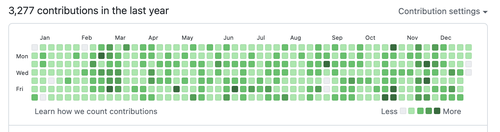

# こんにちは

どうも、僕です。  
2021年もそろそろ終わります。2021年は色々なことがありましたが、簡単にまとめると、機会と出逢いに恵まれた1年だったと思っています。  
さまざまな優秀なエンジニアの方々と仕事をさせていただいたり、コミュニティへ招待していただいたりをしていました。  
自分自身の技術的な成長があったかどうかは微妙ですが、エンジニアとして少しずつ地に足がついてきた実感はあります。  
来年も頑張って行けるように、ここに今年のことをまとめます。
  
ちなみに、GitHub の草はこんな感じで、よくコードを書いた一年だったなと思います。  

# 2021年に書いた記事

2021年はブログを書きました。  
粒度や頻度はバラバラで、素振り程度の記事から、結構頑張って書いた記事までありました。  
また、昨年までは、素振りだろうが技術記事だろうがなんだろうが個人ブログに書いていたのですが、今年はZennに書いてみたり、個人ブログに書いてみたり、メモ帳のような少しライトに書けるものを作ってそこに書いてみたりと媒体を分けて実験をしてみました。結局個人ブログが一番投稿が多くなりましたが、分散してみて、用途ごとに記事を出し分けられるので良かったと思っています。  
来年もこの記事を投稿する媒体を分類するのは続けていきたいと思っていますが、今年は分類がだいぶ雑だったので、もう少し明確に出して行けるようにしたいです。  
また、記事の内容や質にもこだわり、なるべく周りの人に伝わるような内容で、具体的なベンチマークや実測値などを合わせて紹介したり、ハマりどころを説明して行けるようにしたいです。

## 個人ブログ（[https://blog.takurinton.dev](https://blog.takurinton.dev)）

- [JWTについて学ぶ](https://blog.takurinton.dev/post/49)
- [Golangとの半年](https://blog.takurinton.dev/post/50)
- [仕事を始めて感じたこと](https://blog.takurinton.dev/post/55)
- [マルコフ連鎖実装してみた](https://blog.takurinton.dev/post/56)
- [Nuxt入門した](https://blog.takurinton.dev/post/57)
- [GraphQL入門](https://blog.takurinton.dev/post/58)
- [半年で思ったこと](https://blog.takurinton.dev/post/64)
- [iframe のスクロール](https://blog.takurinton.dev/post/67)
- [日報？を作った](https://blog.takurinton.dev/post/68)
- [dumb-init とは](https://blog.takurinton.dev/post/71)
- [インフラのパフォチュー](https://blog.takurinton.dev/post/72)
- [Preact の change event](https://blog.takurinton.dev/post/74)
- [GraphQL の print と parse](https://blog.takurinton.dev/post/75)
- [社会人になったら〜♪](https://blog.takurinton.dev/post/76)
- [GraphQL の parse エディタ](https://blog.takurinton.dev/post/77)
- [自サイトのアクセス可視化](https://blog.takurinton.dev/post/78)
- [自サイトのアクセス可視化2](https://blog.takurinton.dev/post/79)
- [プレイドのインターン終了した](https://blog.takurinton.dev/post/81)
- [addEventListener の第3引数](https://blog.takurinton.dev/post/83)
- [React のメモ化](https://blog.takurinton.dev/post/84)
- [JPHACKS に出場した](https://blog.takurinton.dev/post/87)
- [forwardRef を習得した](https://blog.takurinton.dev/post/88)
- [僕がサブスクを使わない理由](https://blog.takurinton.dev/post/90)
- [マリオのUX](https://blog.takurinton.dev/post/92)
- [検索を作る](https://blog.takurinton.dev/post/93)
- [MySQL の FULLTEXT とは](https://blog.takurinton.dev/post/94)
- [結合時のアルゴリズム](https://blog.takurinton.dev/post/103)

## Zenn（[https://zenn.dev/takurinton](https://zenn.dev/takurinton)）

- [preactとfastifyでSSR](https://zenn.dev/takurinton/articles/4c8625a43f024b)
- [Svelte と Sveltekit を触ってみた](https://zenn.dev/takurinton/articles/5d540c30e72e27)
- [Sveltekit で GraphQL](https://zenn.dev/takurinton/articles/76582f25d942f0)
- [urql コードリーディング](https://zenn.dev/takurinton/articles/ee14cdd8a1630c)

## メモ帳（[https://dev.takurinton.com](https://dev.takurinton.com)）

- [isset と empty について](https://dev.takurinton.com/tech/php/isset_empty.html)
- [compact 関数に関して](https://dev.takurinton.com/tech/php/compact.html)
- [構造化データについて](https://dev.takurinton.com/tech/frontend/struct-data.html)
- [wmr と preact-iso について](https://dev.takurinton.com/tech/frontend/preact-iso.html)
- [Recoil の素振り](https://dev.takurinton.com/tech/frontend/recoil.html)
- [Web Components について](https://dev.takurinton.com/tech/frontend/web-components.html)
- [credentials を指定した際に注意するべきこと](https://dev.takurinton.com/tech/frontend/credentials_all.html)
- [lit-html の素振り](https://dev.takurinton.com/tech/frontend/lit-html.html)
- [Vitejs について](https://dev.takurinton.com/tech/frontend/vite.html)
- [haunted が良い](https://dev.takurinton.com/tech/frontend/haunted.html)
- [Blitz について学ぶ](https://dev.takurinton.com/tech/frontend/blitz.html)
- [React v18 について](https://dev.takurinton.com/tech/frontend/react18.html)
- [GraphQL に入門した（概念）](https://dev.takurinton.com/tech/graphql/concept.html)
- [GraphQL に入門した（Go）](https://dev.takurinton.com/tech/graphql/base_server_go.html)
- [GraphQL に入門した（preact）](https://dev.takurinton.com/tech/graphql/base_frontend_preact.html)
- [SVM について](https://dev.takurinton.com/tech/ml/svm_base.html)
- [クラスタについて](https://dev.takurinton.com/tech/ml/cluster.html)
- [ソフトウェアを構成する12の要素](https://dev.takurinton.com/tech/common/12-factor.html)
- [臨界フリッカー周波数について](https://dev.takurinton.com/dairy/critical-flicker-frequency.html)

### その他

- [PLAIDのインターンでやったこと ~ KARTE接客の施策の基盤改善の試み](https://tech.plaid.co.jp/intern_takurinton/)

# 2022年に頑張りたいこと

仕事の話になりますが、社会人になるので、社会人として技術以外の部分をうまくやって行けるようになりたいです。  
例えば大きなタスクがあるときに、うまくタスクを分割して、順序よく効率よくこなしていくための能力が今の自分には足りません。また、複数のタスクがあるときの優先順位の付け方も曖昧だったり、事業を中心にした物事の考え方がうまくできない傾向にあります。これまでは自分が楽しいからという理由だけでコードを書いてきました。その部分は失わないようにしたいのですが、仕事でコードを書く以上、それよりも優先にすべきことや妥当性の検証などやるべきことがたくさんあるということを忘れずに、組織ベースの思考を身につけ、その上で自分の価値提供をして行けるようにがんばりたいです。

# 2022年に頑張りたいことその2

シンプルに自分には生活力と健康が足りないので、そこを頑張りたいです。  
具体的にできるようになりたいことは以下です。

- 床にゴミを置かない
- 出したものは片付ける
- 電気を消す
- 朝早く起きる
- お酒の頻度を減らす
- 禁煙
- カフェインをやめる
- Suica を落とさない（今年3回やってる）
- キャッシュカードを落とさない
- クレジットカードを落とさない
- 保険証を落とさない（今年2回やってる）

これらを解決する一番大きな方法は物理出社→外食で定食などを食べる→帰宅後すぐ寝るな気がするので、初めのうちは実践したいです。すぐ心折れそうだけど。

# 終わりに

今年1年仲良くしてくださった方々ありがとうございました。  
いろいろありましたが、僕は生きています。また、来年は副業をしてみたり、技術的な挑戦をしたいと思っているので、気軽にお声掛けをいただけると嬉しいです！
来年もよろしくお願いしますmm
