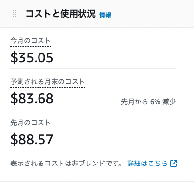

# こんにちは

どうも、僕です。  
今回はブログを SSG にしてみたという話をします。  
年始に SSR をするような構成にしたばかりですが、色々あって（後述）作り替えてみました。

SSR にする記事は以下からどうぞ。

- [ブログを作り直した](https://zenn.dev/takurinton/articles/fc2e7374069e3b)
- [Rust で GraphQL server を書いてみた](https://zenn.dev/takurinton/articles/bab60687f17c2b)

このブログのソースコードはこちら  
[takurinton/ssg-blog](https://github.com/takurinton/ssg-blog)

# なぜ作り直したか

そもそもなぜ作り直したか、理由は 2 つあります。

## AWS の料金が高すぎる

そもそもの話ですが、筆者の [ポートフォリオ](https://takurinton.dev) やブログ、[技術メモ](https://dev.takurinton.com) 等の、サーバと通信をしている場所の周辺の環境は全て AWS の上で動いていました。  
なぜわざわざ AWS に環境を置いているのか、当初の理由としては、2 年ほど前にプログラミングをやり始めた頃、まずは自分 1 人でサーバを立てて何かを作って公開してみようと思って作り始めたのが発端です。

現在の構成は EC2 に Go で書かれた GraphQL サーバがいて、それがモノレポの API server として常時稼働している状態です。DB は RDS を使用しています。  
最初は無料期間があったり、アルバイト等での貯金があったのでよかったものの、無料期間も終わり、無職期間もあり、さらにここ 1 年くらいの請求は毎月 90 ドル弱くらいとなっていたため、若干お財布に厳しい状態になっていました。



しかし、就職した今の自分の金銭感覚で月 10000 円くらいとなると痛いけど別に困るほどではないし、そもそもいつでもサーバにやインフラに近い部分を他人に迷惑をかけずに素振りができる環境を少々割高ではあるが 10000 円で借りてるくらいの感覚だったので別にいいかなくらいの温度感でした。

そこで、どうしてこのタイミングで SSG にしたのかが 2 つ目の理由に続きます。

## wmr を試したかった

2 つめは wmr というライブラリを使用したかったというのがあります。  
筆者は最近 vite 関連の素振りをしていました。会社のプロダクトに入れたかったからです。（結局のところ、見送る形になりそうですが）  
vite の素振りは以下の 2 つのメモにまとめてあります。

- [vite の所感](https://dev.takurinton.com/tech/frontend/vite-suburi-kansou.html)
- [vite on docker container](https://dev.takurinton.com/tech/frontend/vite-server-on-docker.html)

vite は開発環境では直接 ESM を読み込むことによって dev server の初期起動が速い、ファイルの変更検知が速い等の特徴を実現していますが、それと同じ特性を持ったライブラリは他にもあります。今回使った wmr もそうです。（他だと最近メンテナンスされなくなった [snowpack](https://www.snowpack.dev/) とかがそうです）  
そのため、仕事では vite を使ってみたから、次は個人開発で wmr を使ってみようと思ったのが今回のブログリプレイスの背中を押してくれました。（仕事でボトルネックになっていた部分は個人開発では全く気にしなくていい内容だったので使ってみることに）

ちなみに wmr には prerender mode という静的ファイルを吐き出すためのオプションがあり、今回はそれを使用して SSG を実現しています。  
開発環境では markdown ファイルを url 越しに読み込み、本番環境ビルドをするときに静的ファイルとして吐き出します。  
本番環境では各静的ファイルで JavaScript をロードしており、hydration をすることでクライアントサイドで JavaScript のコードが動くようになっています。詳しいエコシステムについては割愛しますが、Preact チームの気合を感じました。

ちなみに wmr についてはこちらの記事が非常に良くまとまっていてよかったです。  
[preactjs/wmr について](https://lealog.hateblo.jp/entry/2021/05/31/144409)

# 技術選定

wmr のスターターを使用しました。他のライブラリも使えるようですが、今回はそのまま Preact を使用しました。  
また、補助的な機能として以下を利用しています。

- marked
  - markdown のレンダリングに
  - [rintonmd](https://github.com/takurinton/rintonmd) で代替したいなー
- highlightjs
  - 記事内に出現するコードの syntax highlight をつけるのに使いました
- hoofd
  - SSG を行う際に meta タグなどの設定を簡単に行えるようにする hooks です
  - build 時に `toStatic` 関数を呼ぶことで設定した各ページの meta タグを取得することが可能です
  - OGP を表示したいため、使用しました

# 実装

Preact で実装をしています。  
リンクの色と文字の太さ以外特に色付けなどはしていませんが、そのうちするつもりです。
markdown 部分は過去のブログで使用していた marked の拡張をそのまま使う形で実装をしていますが、そのうち自作の markdown parser に乗り換えたいと思っています。

また、記事内に登場するコードについて、syntax highlight をつけるために highlight.js を使用していたのですが、これが wmr でバンドルをする際にうまくバンドルできなかったので、この部分だけ hydration 後に CDN 経由で取得するようにしています。  
すごい汚いコードですが、以下のような関数を作成し、これを useEffect で読み込む形の実装にしてみました。

```js
// bundle に混ぜ込むと謎にエラーになるので、分ける
// この命令的なコードが俺の技術力の低さの証明になっている気がしてならない、こんなことしてないでバンドルチューニングをすればいいだけでは
const highlightJsSetup = () => {
  const highlightjs = document.getElementById("highlightjs");
  const highlightcss = document.getElementById("highlightcss");
  const hljsScript = document.getElementById("hljsScript");
  if (highlightjs !== null) {
    document.head.removeChild(highlightjs);
  }
  if (highlightcss !== null) {
    document.head.removeChild(highlightcss);
  }
  if (hljsScript !== null) {
    document.head.removeChild(document.getElementById("hljsScript"));
  }

  const script = Object.assign(document.createElement("script"), {
    id: "highlightjs",
    src: "https://cdnjs.cloudflare.com/ajax/libs/highlight.js/11.6.0/highlight.min.js",
    async: true,
    type: "text/javascript",
  });
  const style = Object.assign(document.createElement("link"), {
    id: "highlightcss",
    rel: "stylesheet",
    href: "https://cdnjs.cloudflare.com/ajax/libs/highlight.js/11.6.0/styles/atom-one-dark.min.css",
  });
  document.head.appendChild(script);
  document.head.appendChild(style);

  script.addEventListener("load", () => {
    const hljsScript = Object.assign(document.createElement("script"), {
      id: "hljsScript",
      innerHTML: `hljs.highlightAll();`,
    });
    document.head.appendChild(hljsScript);
  });
};
```

# 本番ビルド

ローカルで開発をするときや記事を書くときは直接 markdown ファイルを取得し、それを marked を使って html に変換してレンダリングをするようにしています。それをするために `usePost` という hooks を定義して記事を取得するようにしました。  
`usePost` の実装は以下のようになっています。

```ts
import { useState } from "preact/hooks";

const CACHE = new Map();

async function fetchPost(url) {
  const mdStr = await fetch(url).then((res) => res.text());
  let meta = {};
  return { mdStr, meta };
}

export function usePost(id: string): { mdStr: string; meta: any } {
  const url = `/contents/${id}.md`;
  let update = useState(0)[1];
  let post = CACHE.get(url);
  if (!post) {
    post = fetchPost(url);
    CACHE.set(url, post);
    post.then(
      (value) => update((post.value = value)),
      (error) => update((post.error = error))
    );
  }

  if (post.value) return post.value;
  if (post.error) throw post.error;
  throw post;
}
```

この `usePost` 内で使用している fetch ですが、開発環境や記事執筆時にはブラウザで実装されている fetch API を使用してくれますが、ビルドをする際にはそうはいきません。なぜなら自分の環境やデプロイ先の Node.js のバージョンが fetch に対応していないからです。

wmr では prerender mode を使用したビルドを行う際に `prerender` という名前の関数を export しておくとビルド時にそれが呼ばれるようになっています。  
その `prerender` 関数を定義して、本番ビルドの際に実行される fetch を fs で上書きをすることによって、ビルド時にはローカルのファイルを取得して静的ファイルを吐き出すことができるようになります。

```ts
import { VNode } from "preact";

let initialized = false;

export async function prerender(vnode: VNode) {
  if (!initialized) {
    initialized = true;
    const fs = (await eval("u=>import(u)")("fs")).promises;
    // fetch API を定義
    globalThis.fetch = async (url) => {
      const text = () =>
        fs.readFile(`dist/${String(url).replace(/^\//, "")}`, "utf-8");
      return { text, json: () => text().then(JSON.parse) };
    };
  }

  // ...
  // meta タグを取得したり静的ファイルを生成する処理が続く
}
```

# まとめ

金が高い！！！という動機で始めた実装でしたが、ウェブアプリケーションを作るための技術を 1 から理解しようとして作成した最初は空っぽだった EC2 の Linux 環境、頑張って立ち上げた RDS 環境、たまに UPDATE 文に where をつけ忘れたこともありました。さらには見よう見まねで書いた nginx の conf、一生懸命設定したセキュリティグループなどに別れを告げるのは普通に寂しいです。  
この 2 年間、少しばかりお金はかかりましたが、自分自身の技術の試し打ちの場所として動いてくれ、成長させてくれた AWS 環境には感謝しかないです。

また、新しくなったブログも読んでいただけると嬉しいです。

# おまけ

ブログを書き始めるときに、タイトルを入れるとテンプレートを作成してくれる CLI を作りました。scaffold みたいなやつです。  
ソースコードは以下のようになっていて、タイトルをコマンドラインから受け取り、記事一覧を保持してる json に値を追加し、マークダウンのテンプレートを作成するといったシンプルなものです。

```js
import { writeFileSync, readFileSync } from "fs";
import { createInterface } from "readline";

(() => {
  const readline = createInterface({
    input: process.stdin,
    output: process.stdout,
  });

  readline.question("title: ", (title) => {
    const posts = JSON.parse(
      readFileSync(`${process.cwd()}/public/contents/posts.json`, "utf8")
    );
    const ids = posts.map((post) => post.id);
    const newId = Math.max(...ids) + 1;

    const date = new Date();
    let newPost = {
      id: newId,
      title,
      description: `${title} について`,
      created_at: `${date.getFullYear()}-${(date.getMonth() + 1)
        .toString()
        .padStart(2, "0")}-${date
        .getDate()
        .toString()
        .padStart(2, "0")}`.replace(/\n/g, ""),
    };

    writeFileSync(
      `${process.cwd()}/public/contents/${newId}.md`,
      `---
id: ${newPost.id}
title: ${newPost.title}
description: ${newPost.description}
created_at: ${newPost.created_at}
---
`,
      (err) => {
        if (err) throw err;
        console.log(`${newId} created.`);
      }
    );

    const newPosts = [...posts, newPost];
    writeFileSync(
      `${process.cwd()}/public/contents/posts.json`,
      JSON.stringify(newPosts),
      (err) => {
        if (err) throw err;
        console.log(`posts.json updated.`);
      }
    );
    readline.close();
  });
})();
```

これを以下のように実行するとファイルを作成してくれます。

```
yarn gen

title: ブログをSSGにした
109.md created.
posts.json updated.
```

生成された markdown

```
---
id: 109
title: ブログをSSGにした
description: ブログをSSGにした について
created_at: 2022-08-14
---
```
