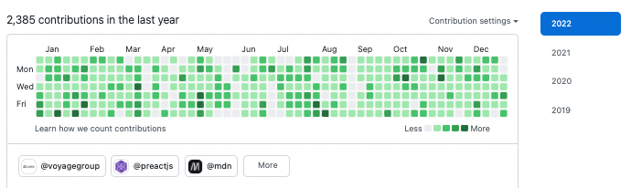

# こんにちは

今年は散々な年だったため書かなくて良いかなと思っていましたが、こういうのは後から見てみてこういうのもあったなーと振り返るものな気がするので一応書いておきます。

去年の振り返りはこちらです。

@og[https://blog.takurinton.dev/post/105]

去年に倣って GitHub の草を載せるとこんな感じです、去年と比べるとあまりコードを書かなかった 1 年だったように感じます。

# ざっくり時系列

## 1 月

卒論の提出期日を間違えてました。

@twitter[https://twitter.com/takurinton/status/1479329120161263616]

## 2 月

卒論を頑張っていました。

## 3 月

卒論を提出して無事卒業が確定しました。  
引っ越しをしたりバイトをしたりしてとても忙しかったように感じます。

引っ越して早々、新居が変な色になりました。

@twitter[https://twitter.com/takurinton/status/1503907612886450176]

## 4 月

社会人になりました。  
ずっと体調を崩していてほぼ記憶がありません。

## 5 月

ずっと体調を崩していてほぼ記憶がありません。

## 6 月

ずっと体調を崩していてほぼ記憶がありません。

## 7 月

ずっと体調を崩していてほぼ記憶がありません。

## 8 月

このままだと仕事ができないと感じたので、とりあえず朝は散歩をしてみたり、お酒とタバコをやめてみたりしました。  
この後、体調が改善して年末には見違えるくらいになるのですが、その第一歩を踏み出すことができたような気がします。

8 月下旬にコロナウイルスに感染しました。解熱後も 3 週間くらいは倦怠感や息切れ、いわゆるブレインフォグのような状態等が続きやっと改善してきた体調が一気にどん底へと行きました。  
これは一般的に罹患後症状と言われるものですが、この状態が 2 ヶ月以上続くと後遺症という扱いになるようです。自分は 3 週間程度で治まったのでよかったものの、その期間は辛かったです。身近な人でコロナウイルスに罹った後しばらくだるさ等が続いてる人がいたらどうか優しくしてあげてください。

## 9 月

少しずつ体調が改善してまともに仕事ができるようになりました。  
とはいえ体調が不安定なことには変わりなく、気分も不安定でした。

## 10 月

やっと軌道に乗り始めたような気がします。  
少しずつ体調が改善していき、仕事もそれなりにできるようになりました。

10 月は猫を飼い始めました。名前はハッシュです。

@twitter[https://twitter.com/takurinton/status/1581598013440819200]

名前の由来はハッシュアルゴリズムからきており、自分はハッシュアルゴリズムを実装したことがなかったので SHA-256 を実装したりしていました。名づけるなら最低限これくらいやるべきな気がしました。

@og[https://blog.takurinton.dev/post/111]

## 11 月

ほぼ万全な状態で仕事ができるようになり、外出も好きなタイミングでできるようになりました。（8 月くらいまではほぼできず、8 月以降は体調が良い日はできるといった具合でした）

## 12 月

体調もだいぶ安定してきたので、体力をつけたいなと思い Garmin という時計を買い、ランニングを始めました。

年末時点で走り始めてから 2 週間半くらいで、1 キロ 4 分半くらいのペースで 10 キロ程度であれば楽に走れるくらいにはなりました。まだまだ自分は若者を自称しても問題ないなと感じました。

# 仕事

割と地味で大変な仕事をコツコツとやっていました。  
元々辛いなと感じながらやっていたのですが、12 月に入ったくらいからは完全にバーンアウトしてしまい、無気力感が強かったように感じます。  
その他にも体調不良であったり自分のモチベーション的な面で課題があり、特にこれといった成果も残せなかったので来年は頑張りたいです。

# 趣味

## ランニング

自分はあまり趣味がないタイプですが、12 月に入ってから始めたランニングはだいぶ楽しめています。  
上に書いたように、10 キロ程度なら楽しく走ることができますし、そこそこ向いてる自覚もあります。生活習慣や自律神経も整いますし、健康を簡単に手に入れられるのでこれからも楽しく継続していきたいです。  
機会があれば 2023 年の秋以降にあるフルマラソンの大会に幾つかエントリーしてみたいです。

## プログラミング

去年に比べて手を動かす機会がだいぶ少なかったのですが、とはいえちょこちょこものを作っていました。  
以前までは適当に何かを作る際は TypeScript を使っていたのですが、今年は意識的にそれをほぼ Rust にしました。だいぶ手に馴染んできたのでどこかのタイミングで Rust で実用的な何かを作ってみたいです。  
とはいえ基本的にブラウザに近い部分のコードを書く際は TypeScript を使っています。（Rust で DOM をいじる世界は来るのだろうか）

## OSS

タイポ修正を除くと、Preact の [wmr](https://github.com/preactjs/wmr) に少しだけコミットしていました。

- [Add globalThis.fetch #934](https://github.com/preactjs/wmr/pull/934)
- [Feat proposal enable fetching external resources using native fetch API in Node.js version 18 later #935](https://github.com/preactjs/wmr/pull/935)
- [Fix Node.js version of GitHub Actions workflow #936](https://github.com/preactjs/wmr/pull/936)

# ブログとメモ

割と真面目にまとめたい場合はブログに、簡単なものを作ってみた時や社内に共有用として投げる場合はメモに、誰かに見てほしいようなものを書きたい場合は Zenn に書きました。

## ブログ

- [Svelte と SPA](https://blog.takurinton.dev/post/108)
- [ブログを SSG にした](https://blog.takurinton.dev/post/109)
- [wmr の prerender 時に明示的な fetch の定義が不要になる](https://blog.takurinton.dev/post/110)
- [SHA-256 algorithm](https://blog.takurinton.dev/post/111)

## メモ

- [技術についての考え方](https://dev.takurinton.com/dairy/thinking-tech-myself.html)
- [Web Components と React](https://dev.takurinton.com/tech/frontend/web-components-react.html)
- [x-link というタグを定義した](https://dev.takurinton.com/tech/frontend/rintonmd-link-component.html)
- [rintonwc for React](https://dev.takurinton.com/tech/frontend/rintonwc-react-component.html)
- [urql で SSR するには](https://dev.takurinton.com/tech/frontend/urql-ssr.html)
- [ingred-ui contrast](https://dev.takurinton.com/tech/frontend/ingred-ui-contrast.html)
- [ingred-ui 改善点](https://dev.takurinton.com/tech/frontend/ingred-ui-design-system)
- [数値入力のスクロール問題](https://dev.takurinton.com/tech/frontend/how-to-resolve-scrolling-when-input-type-number)
- [Vite の所感](https://dev.takurinton.com/tech/frontend/vite-suburi-kansou)
- [vite server on docker](https://dev.takurinton.com/tech/frontend/vite-server-on-docker)
- [marked extension](https://dev.takurinton.com/tech/frontend/custom-syntax-using-marked-extension)
- [calender ui](https://dev.takurinton.com/tech/frontend/calender-ui-prototype)
- [calender ui with infinity scroll](https://dev.takurinton.com/tech/frontend/calender-ui-prototype-with-scroll)
- [calender ui scroll performance improvement](https://dev.takurinton.com/tech/frontend/calender-ui-prototype-with-scroll-performance-improvement)
- [canvas でグラフを描く](https://dev.takurinton.com/tech/frontend/graph-with-canvas)
- [input[type="date"] とよく似た何かを作ってみる](https://dev.takurinton.com/tech/frontend/dateinput-components)

## Zenn

- [ブログを作り直した](https://zenn.dev/takurinton/articles/fc2e7374069e3b)
- [Rust で GraphQL server を書いてみた](https://zenn.dev/takurinton/articles/bab60687f17c2b)
- [Brainfuck を書いた](https://zenn.dev/takurinton/articles/c155becd726c52)

# 来年

今年は心身の不健康が原因で不完全燃焼だったので来年は健康人間になり仕事や趣味を頑張りたいです。  
また、副業をやってみたいと思ってるので、それも頑張りたいです。
