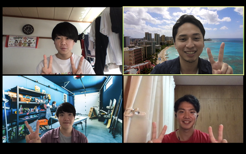

# こんにちは
どうも、僕です。
今回はサイバーエージェントの就業型インターンに参加して、Ameba事業本部という部署で少しだけコード書かせてもらったのでそのことについて記事にしたいと思います。

# 参加した経緯
これは遡ること2月、、、

僕が某企業のアドテクのインターンに参加して、楽しかったことを大学の先輩のYさんに報告しました。  

僕「この前アドテクのインターンに参加して、DSP周りのコードを簡単にですけど書いたんですよ〜」  
Yさん「へー、楽しそうじゃん、いいね」  
僕「ちょっとだけアドテクに興味持ちました！」  
Yさん「サイバーのインターン行けばもっと長い期間、大きな規模の広告捌けるよ」    
  

本人が覚えているか分かりませんが、このような会話を今年の2月に話しました。その時から、サイバーの広告の部署でのインターンは密かに狙ってました。

その後、エントリーシートを書いて、面接をして合格し参加が確定しました。
面接はだいぶ突っ込んだことを聞かれ、あたふたしてましたが無事通ってよかったです。（種を撒いたのは自分自身ですが）

# 参加確定後
参加確定後はGoの勉強を始めました。ちょうどTreasureの事前課題が終わっていよいよ開始って時くらいでした。フロントエンド講義にひいひいしてる時に合格の連絡が来てとても嬉しかったのを覚えています。A Tour of Goの日本語バージョンがなぜか死んでいて、英語バージョンで頑張ってました。
  
  
本番が始まる前には事前面談も組んでいただき、自己紹介ややってきたこと、やりたいことなどをブラッシュアップしていただき、本番までにしっかりと備えることができました。また、事前にメンターの方と顔を合わせておくことで本番の時に緊張しなくて済んだり、早く打ち解けることができると思うのでインターン前の事前面談めちゃくちゃ大事だなとか思いました。

# インターン開始
いよいよインターンが始まりました。  
僕のメンターを務めてくれたのは今年新卒の永井さんという方でした。永井さんはとても優しく、質問にもなっていない質問から細かいところ、実装とは関係のない質問にも丁寧に答えてくださり、さらには就活についての話や僕個人についての話など様々なことを話してくださり、とても話しやすく充実したインターン期間を過ごすことができたと思います。

## 就業部署について
先に書きましたが、Ameba事業本部というところでした。Ameba事業本部とは何をしている部署かというと、主にDSPの開発をしている部署で、アメブロへの広告配信や外部のSSPとやりとりをして広告を返すというやりとりをしている部署です。アドテクにおいてDSPにはとても速さが求められるため、非常に効率化されたコードになっています。そのため毎秒3万〜5万リクエストを捌くことができるらしいです。シュゴイ。  
  
また、コードの規模がとても大きなプロジェクトで、どことどこのメソッドが関わっているか、引数と戻り値がどうか、どのようなことをしてるのか、など全体の処理を追うのが大変でした。メンターの永井さんに質問しながらとても丁寧に答えていただき、なんとか理解することができました。（完全には理解しきれてなかったけど自分の実装する部分だけはなんとか）
 

## 環境構築
さすが企業のコードです。初めて就業型のインターンシップに参加したのですが、セキュリティがえぐかったように感じます。社内ポータルに入ったりSlackに参加したり以外に、必要な環境構築だけで2日くらいかけました。権限の付与や認証などの設定がめちゃくちゃめんどくさかったです。まあ必要なことなんだけど。

## タスクについて
僕に与えられたタスクは既存のJSONのシリアライズとデシリアライズをより高速化する easyjson の導入でした。
easyjson については[こちら](https://github.com/mailru/easyjson)
  

既存のJSONのシリアライズとデシリアライズには encoding/json というパッケージを使用していました。  
encoding/json と easyjson の大きな違いは、速さはもちろんですが引数と戻り値の型です。

encoding/json でのシリアライズとデシリアライズには、引数と戻り値に interface{} 型を許容します。しかし、easyjson では引数はその関数によって決まっています。  
つまり、変換したい構造体が多く、汎用的に処理をする関数が欲しい時には encoding/json 、変換したい構造体が少なく、局所的な処理をしたい時には easyjson が向いているということになります。  
詳しい事は言えませんが、そういった点では、今回は easyjson の方が向いていました。  

  
実際に easyjson に置き換えてみて、時間を計測しました。計測にはアパッチベンチを使用して、雑に1000回くらいリクエストを送って、変換にかかった時間をまとめるといった感じです。
その結果を簡単にまとめたのが以下の画像になります。

もともとが速いので変化量が小さいように感じますが、実際に速くなっていることが確認できます。よかった、、、。
また、標準偏差も出してみると、encoding/json よりも値が小さいため、 easyjson の方が安定して速度を出すことができるということがわかりました。
  
## つまづきポイント
そもそもGoをあまり知らない状態で行ったのでつまづきだらけでした。  
なんでGoでやりたいですって志願したかはどっかの人事の人なら知ってるかもしれないです。（誰にも通じない話）

  
簡単にまとめると

- コードがでかい
- 型のある言語に触れてこなかったのできつい
- easyjson ではinterface{} は使えない
- ネストした構造体

といった感じです。全て自分の勉強不足や実力不足から来るものなのでこれから勉強して強くなりたいと思います！でもこれらの点は実際にコードを読んだり書いたりする過程で自分の中で改善することができ、少しだけ自信がついたのでとても良い経験ができ、成長することができたと思っています。

# インターン期間中にあったこと
インターン期間中には業務以外にもいろいろなことがありました。  
リモートでのインターンだったこともあり、普段以上に人事の方や社員の方がインターン生にサイバーエージェントを知ってもらおうと思って行動してくださった結果だと思っています。とてもありがたいことです。感謝してもしきれません！！！！

## 社内イベントに参加した
どこまで話していいのかわかりませんが、社内のイベントに参加させていただきました。バーチャル空間でブラブラ歩き回ったり、メンターの永井さんやYさんなどを観測することもできました。また、社内の方のお話を聞くことでマインドや働き方、突出した技術についても知ることができました。

## インターン生×人事でのランチがあった
インターン生と人事の方でオンラインですがランチを食べてお話をするという機会を設けていただきました。コロナについてや就活のこと、その他サイバーエージェントについての質問などして、とても楽しい時間になりました。縦のつながりだけではなく横のつながりがとても大事ということが改めてわかり、このような機会をいただけたことに感謝しています。
  
下の写真はその時に撮っていただいたものです。  
とても楽しかったです(๑˃̵ᴗ˂̵)  

## コーヒーブレイクがあった
これは僕の部署の方が開催してくれて、毎日ではなかったですが15時から30分ほどZOOMで集まりみんなで休憩がてらお話しするというものがありました。その時間で部署の方ともコミュニケーションをとることができ、部署の方やサイバーエージェントのことを知るとてもよい機会になりました。また、これは後から聞いた話ですが、このコーヒーブレイクはそこまで頻繁に開催してるものではなく、インターン生と関わろうということでインターン期間だけ多めに開催をしてくれたようです。そのようなことをしてくれたり、そこに集まってくれたりするサイバーエージェントで働く方の良さというものを身に染みて感じることができました。

# 最後に
このインターンを通じて、実際に業務で使用しているコードを目で見て、肌で感じることができ、とてもいい経験になりました。  
また、自分の弱さや実力不足を痛感しました（毎回してる）

この経験を無駄にしないように今後実務のコードから学んだことを積極的にアウトプットをして吸収することができるように頑張りたいと思います。 

このインターンに関わってくださった全ての方々、ここまで読んでくださった方、ありがとうございました！！！

  
  
  
# 追記
サイバーエージェントさんから荷物が送られてきて、開けたらたくさん入ってました！

ステッカーやメモ帳、色紙などなど！とても嬉しい( ；∀；)
本当に最後まで最高でありがたいです！！

  
  
  
  
  
  
  

  
  
おしまい
