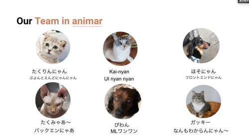

# こんにちは
どうも、僕です。今回は夏の締めくくりに参加した楽天のインターンについて書きたいと思います。  
楽天のインターンはここまでのインターンの中で一番辛かったような気がします（言語的な問題）  
海外で仕事できる気がしませんでした。そんな感じでまとめていきます。

# 選考
インターンには選考がつきものです。  
選考内容はコーディングテストと面接で、両方とも1日で終わらせます。参加者全員。
コーディングテストはcodilityというサービスを使います。ググるのは禁止だそうで、バレたらどうなるかは知りません。面接はエンジニアの方2人と行い、こちらは普通の面接といった感じでした。  
また、英語に対して抵抗はないかと聞かれました。余裕ですと言ったのですが、実は全然余裕ではなかったので本番苦労しました。
  
選考自体はとても忙しかったですが、3日ほどで結果の連絡も来てとてもスピード感のある選考だったように思います。また、選考会やインターン本番に知ってる人もちらほらいたためとても楽しかったです。

# インターン本番
選考は7月で、自分の参加したC日程は9月14日から9月25日までの2週間で行うもので、内容はハッカソン形式でした。

  
## お題
ハッカソン形式なのでお題があります。  
お題は  
「オンラインで人と人をつなぐ」  
といったものでした。聞き飽きたように感じますが、別に某ウイルスのことを言ってるとは限らないですし、時流といえば時流なので全然オッケーです。(๑˃̵ᴗ˂̵)
 

## チーム
チームはどこかの大学院生4人とどこかの学部生2人（僕を含む）の6人で形成されていました。最初はみんな人見知りをしていたように感じますが、インターンが進むにつれて心を開いていき、最後にはめちゃくちゃ仲良くなれました！！
チームメンバーについてはUI/UXが強い人、WebはわからないけどAIが強い人、ガッキー、などなどそれぞれの強みを持った人がいましたが、全員Pythonを触れるという共通点がありました。多分コーディングテストの使用言語でチームわけしてるんじゃないかなとか思ったりしました。  

## お題ついて考える
ハッカソン系のインターンではまずはここからスタートします。辛い。  
僕たちのチームはコロナで人と会えなくなったことと、動物との触れ合いをテーマに作るものを考え、miroを使ってみんなの意見を可視化していきました。    
話し合った結果、動物目線で使用することができるSNSを作ることになり、設計に入りました。  
動物目線とは、利用者が動物になり切って使用することができることを目標にしており、そこに対してのUIやUXのアプローチ、また今回は実装できませんでしたが投げ銭機能やマネタイズの方法についてのことも話し合いました。    
作るものに関しては時間制限もあったため思ったよりも早く決めることができたのではないかなと思います。  
  
また、このアプリを使用した人は以下の画像のようになってしまうようです。
  
  
  
  

  
  
  
  
猫になりたいですね♪(´ε｀ )

  
  
  
## 使用技術
実装は、フロントエンドはReact、バックエンドはDjangoで行いました。
選定理由はフワッとしていて、フロントエンドに関してはReactを深く触ったことがある人はいませんでしたが興味本位でという感じ、バックエンドは全員Python触れるからDjangoで、さらに僕たちのプロダクトは画像認識も取り入れたため、Pythonでのフレームワークを使用しようということになりました。    
SPAにした理由としては、画面遷移の多い動的なサイトになると考えたからですが、その場合の認証はどうするか、localStorageでセキュリティ的に大丈夫かなどの課題がありました。（結局localStorageにした）  
  
また、これは個人的に思ったことですが、認証はfirebaseに任せて、React+Flaskなどの選択肢もあったのではないかなとか思ったりしました。  

## 実装
自分はフロントエンドの実装を担当し、Reactを使用しました。ものを作る系インターンでの1番の壁であろうUI/UXなんもわからん現象が起きるかと思いきや、僕たちのチームにはそこに対しての知見があるメンバーがいたためとても可愛いUIを実装することができました！
  

  
  
  
  
例えばこんな感じで404を実装したりしました。  
Reactの書き方の方針としては、アロー関数を使う、hooksを使っていく、などなどを適当に決めて実装を行いました。  
また、UIのフレームワークとして、MaterialUIを使用しました。理由としては、コンポーネントの管理がしやすいことでしたが、importがカオスになりがちなので考えないといけないなとか思ったりしました。UI系のフレームワークは本当にすごく書きやすいですし、ハッカソンなどの短い期間での開発ではとても重宝されるのでもっと勉強しようと思いました。

## プレゼン
プレゼンは15分間、英語で行うものでした。僕たちのチームは中間発表で寸劇を繰り広げる形でニーズやソリューション、ユースケースなどを説明しました。  
プレゼンでは人事の方の名前を借りて寸劇を繰り広げ、まあにやっとしてくれたので自分たちの目標は達成したのではないかなと思います。  
もちろん寸劇だけではなく真面目に発表する場面もありました。（僕は寸劇専門でしたが）  

## 感想
環境構築だったり実装でつまづくことが何度かあったり、意外と実装に使える時間が少ない中でいかに実装できるかを考えて、休日や夜の作業は極力避けながら健康的にコードを書くことができたと思います。 
また、皆さんの技術力の高さや頭の回転の速さ、英語力などに圧倒されながらとても刺激的な2週間を送ることができました。
他のチームの方も技術力が本当に高く、この短期間で実装したとは思えないようなものもたくさんあり、とても刺激をもらうことができました。  
  
しかし、スケジュールの立て方があまり良くなかったり、設計や実装途中でのコミュニケーションが上手く取れていない部分もあったのでそこは次何かチームで開発することがあれば改善できるように頑張っていきたいと思います。このチームで本当によかったし、みんなと仲良くなれてとても幸せでした(๑˃̵ᴗ˂̵)

## インターン中にあったこと

- 友達が寝坊した
    - ぬのが遅刻してた
    - 2回もしてた
    - みんなの前で名前呼ばれてた
- 中間発表でギャグをした
    - 中間発表ではお笑いのようなことをしました。
    - ストーリー性のあるコントのような感じでした。
- Dockerが動かない
    - Dockerが動かないメンバーが何人かいたので期間も短いためDockerはなしにしました。
    - これが命取りになります
- 本番前日に動かない
    - 明らかに進捗がないのは目に見えていたのですが、前日の夕方に動かしてみても動きませんでした。
    - なぜか理由はわかりません
    - 動くメンバーに託しました
- スライドがきつい
    - スライド作成がきつくて当日の朝みんなで焦って頑張りました
    - カンペの作成もめんどくさかったです
- 他のチームがカオスすぎる
    - コードフリーズは木曜の昼で、金曜は丸々発表って言われてたのに金曜の昼までGitHubにコミットしてるチームがありました
    - いつ寝てんだ

## 英語について
僕は全然なのですが、このインターン全体を通して英語を話せる人の割合がとてつもなく高かった気がします。楽天といえば英語みたいな感じがあるので自然に英語を話せる人が集まるのはわかりますがそれにしてもすげえなって感じでした。どこかで特殊な訓練を受けているんでしょうか。  
あとは帰国子女も多かったような印象があります。  
  
また、社員さんやメンターさんも英語がメインなので、コミュニケーションも英語でとったりしてました。個人的には発表英語は別に問題ないのですが、日常会話にまで英語が入ってくるのがだいぶ苦しかったです。なんとかなったのでよかったですが、英語をしっかり勉強しようという気持ちになりました。

# まとめ
今回このインターンに参加して、一番辛かったのは英語ですが、開発面でも辛いことや楽しいことなどたくさんありましが、みんなで何かを作るということは楽しいことであり、素晴らしい体験であることを実感しました。  
  

  
また、夏インターンの締めくくりとしてとても楽しく、貴重で充実した体験をすることができたと思います。  
来週からは学校にいくのでしばらく会えてなかった人はたくさん夏の思い出を共有しましょう！
  
  
  
おしまい♪(´ε｀ )
