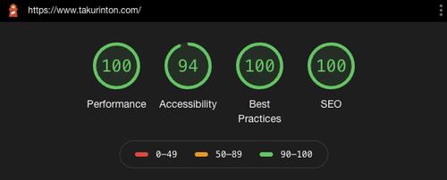

# こんにちは
どうもこんにちは。僕です。  
最近あったことといえば、Vのインターン落ちて落ち込んでるところに人事の方からのなぐさめのDMがきてさらに泣きそうになったところでRからの内定もらってなんだかメンタルが忙しいことです。  

今回は僕がポートフォリオを作り替えた話（需要あるのか？）について話していこうと思います。  

# なんで作り替えたの？
まずここから  
作り替えた理由としては3つあります。

- Next.jsを試したかった
  - 月曜日にあった勉強会でNextの話出てきて感化されちゃった（元々やりたいとは思ってた）
  - SSR真面目にやりたかった
  - OGPの動的な変更をしたかった（それ用の部分的に使えるライブラリが出てきてメジャーになってもいいのかなと思ってる）
- ドメインを無駄に増やしたくない
  - 今までサブドメイン使っていろいろサイト公開してきた
  - お金かかるし管理めんどくさいので1つに統合したかった
- 暇だった
  - 暇でした

とまあこんな感じで、思いつきで作った感じになりました。  
テストとか課題とかあったのですが睡眠時間を削ることでなんとか4日間（火曜から金曜）で仕上げることができました。  

# 環境構築
まずは環境構築です。特にツールなどは使わずに適当にやりました。(create-next-appとやらをだいぶ開発を進めてから知ったので使ってないだけ)  
また、package.jsonについてはライブラリ管理がめんどくさいので以前のReact製のブログで使用していたものをそのまま流用しました。  
nextはインストールされていなかったので追加し、scriptsの部分はNext用に変更しました。  


```json
// package.json

{
  "name": "portfolio",
  "version": "0.1.0",
  "private": true,
  "dependencies": {
    "@material-ui/core": "^4.11.0",
    "@material-ui/icons": "^4.9.1",
    "@testing-library/jest-dom": "^4.2.4",
    "@testing-library/react": "^9.3.2",
    "@testing-library/user-event": "^7.1.2",
    "@types/highlight.js": "^9.12.4",
    "@types/jest": "^24.0.0",
    "@types/marked": "^1.1.0",
    "@types/react-dom": "^16.9.0",
    "@types/react-router-dom": "^5.1.5",
    "aria-query": "^4.2.2",
    "fontsource-roboto": "^3.0.3",
    "highlight.js": "^10.2.1",
    "marked": "^1.2.0",
    "next": "^10.0.1",
    "now": "^20.1.2",
    "query-string": "^6.13.6",
    "react": "^16.14.0",
    "react-dom": "^16.14.0",
    "react-highlight": "^0.12.0",
    "react-highlight.js": "^1.0.7",
    "react-intersection-observer": "^8.30.1",
    "react-markdown": "^4.3.1",
    "react-scripts": "3.4.3",
    "react-syntax-highlighter": "^15.2.0"
  },
  "scripts": {
    "start": "next start",
    "build": "next build",
    "dev": "next dev",
  },
  "eslintConfig": {
    "extends": "react-app"
  },
  "browserslist": {
    "production": [
      ">0.2%",
      "not dead",
      "not op_mini all"
    ],
    "development": [
      "last 1 chrome version",
      "last 1 firefox version",
      "last 1 safari version"
    ]
  },
  "devDependencies": {
    "@types/node": "^12.19.3",
    "@types/react": "^16.9.56",
    "@zeit/next-sass": "^1.0.1",
    "@zeit/next-typescript": "^1.1.1",
    "babel-plugin-styled-components": "^1.11.1",
    "node-sass": "^5.0.0",
    "typescript": "^3.9.7"
  }
}
```

```bash
npm i
npm build
```

これでおけまるです。

# 簡単な設定を行う
まず、ルーティングについてですが。Nextはルーティングをよしなにしてくれるダイナミックルーティングとかいうやつがあるらしいのでそれに従うことにしました。
こやつは```pages/```直下にあるものを勝手にやってくれるみたいです。  
また、共通部分に関しては_app.tsxと_document.tsxというものがあり、これを```pages/```の下におくとルーティングとは別にheadやhtml、共通部分の設定をしてくれるみたいです。  
てことでそこから書いていきたいと思います。
  
## _app.tsxと_document.tsxの定義を行う
_app.tsxでは共通部分の定義を行っています。先ほどheadと言いましたが、自分は動的に変えたいのでそれは別定義していますのでここにはありませんが、いい感じに外側を定義することができます。
```ts
// _app.tsx
import React from "react";
import { Container } from "next/app";
import { Layout } from '../component/common/layout/Layout'

const App = ({ Component, pageProps }) => {
    React.useEffect(() => {
      const jssStyles = document.querySelector('#jss-server-side');
      if (jssStyles) {
        jssStyles.parentElement.removeChild(jssStyles);
      }
    }, []);
    
    return (
      <>
        <Container>
            <Layout>
              <Component {...pageProps} />
            </Layout>
        </Container> 
      </>
      );
}

export default App
```

_document.tsxではbodyやhtmlのタグの設定がメインになります。<html />ではlighthouseのaccessibilityが下がってしまうのでここでしっかり定義します。
ここのMainやHtmlが何を示すのかはまだしっかり理解できていませんが、とりあえず必要らしいので定義します（あとでドキュメント読む）  
また、プチハマりしかけたのですが、この_document.tsxで定義するクラスはNextDocumentを継承しないといけないらしいです。

```ts
// _document.tsx
import * as React from "react";
import NextDocument, { DocumentContext, Html, Head, Main, NextScript } from "next/document";

interface Props {}

class Document extends NextDocument<Props> {
    render() {
      return (
        <Html lang="ja">
          <Head />
          <body>
            <Main />
            <NextScript />
          </body>
        </Html>
      )
    }
  }

export default Document
```

## Layoutを簡単に定義する
また、自分はLayoutコンポーネントを作ってそこに共通部分を記述し、_app.tsxで使用しました。
```ts
// Layout.tsx
import { Header } from '../parts/Header'
import { HtmlHead } from '../Head'

export const Layout = (props) => (
    <>
        <HtmlHead 
            title={'たくりんとん'}
            description={'たくりんとんのポートフォリオです'}
            image={'me.jpg'}
            url={'https://takurinton.com'}
        />
        <style>{`* { margin: 0; padding: 0; }`}</style>
        <Header />
      {props.children}
    </>
);

```

## Headを定義する
headはOGPやタイトルの関係もあり動的に変更したいと思っていたのでここで動的に定義することができるようにします。  

```ts
// Head.tsx
import Head from 'next/head';
import { HeadProps } from '../../props/props'

export const HtmlHead = ({ title, description, image, url }: HeadProps) => {
  return (
    <Head>
      <title>{title}</title>
      <meta name="description" content="たくりんとんのポートフォリオです" />
      <meta property="og:title" content={title} />
      <meta property="og:description" content={description} />
      <meta property="og:type" content="blog" />
      <meta property="og:url" content="https://www.takurinton.com" />
      <meta property="og:image" content={image} />
      <meta property="og:site_name" content={title} />
      <meta name="twitter:card" content="summary_large_image" />
      <meta name="twitter:url" content={image} />
      <meta name="twitter:title" content={title} />
      <meta name="twitter:description" content={description} />
      <meta name="twitter:image" content={image} />
      <link rel="shortcut icon" href={"me.jpeg"} />
      <link rel="apple-touch-icon" href={"me.jpeg"} />
      <link rel="stylesheet" href="//cdnjs.cloudflare.com/ajax/libs/highlight.js/9.6.0/styles/solarized-dark.min.css" />   
      </Head>
  )
}
```

## propsを定義する
TypeScriptでは型の定義が必要なので、自分は使うpropsは全部```props/props.ts```に入れてそこから適宜引っ張ってくるみたいな構成にしています。バックエンドは出来上がっているのでそれに合わせたものを先に作成します。

```ts
// props.ts

export interface InternProps {
    id: number, 
    company_name: string, 
    overview: string, 
    period: string 
}

export interface MadeProps {
    id: number, 
    name: string,
    url: string, 
    explanation: string
}

export interface SkillProps {
    id: number, 
    name: string
}

export interface MineProps {
    content: string
}

export interface PortfolioProps {
    intern: InternProps[]
    skill: SkillProps[], 
    made: MadeProps[], 
    mine: MineProps
}

export interface Dairyreport {
    id: number, 
    pub_date: string
}

export interface DairyreportProps {
    next: number | null, 
    prev: number | null, 
    results: Dairyreport[]
}

export interface DeiryreportPost {
    pub_date: string, 
    contents: string
}
export interface DairyreportContent {
    comment: [], 
    post: DeiryreportPost
}

export interface HeadProps {
    title: string;
    description: string;
    image: string;
    url: string;
}

export type GetPost = {
    next: string, 
    previous: string, 
    total: number, 
    category: any,
    current: number, 
    results: PostProps[], 
    page_size: string, 
    first: string, 
    last: string
}

// post
export type PostProps = {
    id: number,
    title: string, 
    category: string,
    contents: string, 
    contents_image_url: string,
    pub_date: string,
    comment: CommentProps[]
}
export const initialPost:PostProps = {
    id: 0,
    title: '', 
    category: '', 
    contents: '',
    contents_image_url: '', 
    pub_date: '', 
    comment: []
}

// category
export type CategoryProps = {
    category: string[]
}
export const initialCategory:CategoryProps = {
    category: []
}


// comment
export interface CommentProps {
    name: string, 
    contents: string, 
    pub_date: string
}
export const initialCommentState:CommentProps = {
    name: '', 
    contents: '', 
    pub_date: ''
}
export const initialComment:CommentProps[] = [
    {
        name: '', 
        contents: '', 
        pub_date: ''
    }
]

// search
export type TypeSearch = {
    content: string, 
}
export const initialSearch = {
    content: '', 
}
```

# ルーティングしてく
やっと最初にやっておくと幸せになれる定義が終わったので先述したダイナミックルーティングやっていきます！
ディレクトリ名に依存するみたいです。  
例えば、
```
pages/index.tsx  →  https://domain.com 
pages/blog/index.tsx  →  https://domain.com/blog
pages/blog/[id].tsx  →  https://domain.com/blog/{id}
````
のような形になります。もし動的なルーティングを行いたかったら[any].tsxのようなファイルを作成するとそのような形のルーティングになります。よさげ〜〜〜。

# GET Requestしてく
NextではgetInitialPropsという関数で情報をフェッチしてSSRしてくれるらしいです。  
てことで積極的に利用していこうと思います（共通化とかした方がいいのかな？？）

まずはルートからやっていきます。  
ルートにブログも置いてるので、欲しい情報はブログ関連になります。ブログのエンドポイントを叩いたらこんな感じになりました。  
HomeとBlogはそれぞれトップ画面とブログの投稿一覧を表示するためのコンポーネントになっています。  
内容についてはGitHubにあるので気になる方は確認してみてください。

```ts
// pages/index.tsx
import { Home } from '../component/main/Home'
import { Blog } from '../component/blog/Blog'

const Main = ({ res }) => {
    return (
        <div>
            <Home />
            <Blog props={res}/>
        </div>
    )
}

Main.getInitialProps = async (context) => {
    const query = context.asPath.split('?').length === 1 ? '' : '?' + context.asPath.split('?')[1] // 汚いので要修正
    const res = await fetch(`https://api.takurinton.com/blog/v1/${query}`)
    const response = await res.json()
    return { res: response, q: query }
}
export default Main
```

次はブログの記事詳細についてみてみたいと思います。  
ブログの詳細については```domain/post/{id}```で取得したかったので```pages/post/[id].tsx```という場所にファイルをおきました。  
それぞれのコンポーネントの中身については割愛しますが、ここではブログの情報をフェッチしてきて内容をBlogDetailというコンポーネントに渡しています。BlogDetailではマークダウンの処理やコメントコンポーネント（あとで出てくる）を呼び出しています。基本的には可愛くする処理です。    
  

また、補足ですがgetInitialPropsは引数をとることができ、その引数にはcontextが渡されます。　
ドキュメントには以下のように書いてあります。

```
Context Object
getInitialProps receives a single argument called context, it's an object with the following properties:

- pathname - Current route. That is the path of the page in /pages
- query - Query string section of URL parsed as an object
- asPath - String of the actual path (including the query) shown in the browser
- req - HTTP request object (server only)
- res - HTTP response object (server only)
- err - Error object if any error is encountered during the rendering
```

それを踏まえた上で[id].tsxを書いていきます。  

```ts
// pages/post/[id].tsx

import { BlogDetail } from '../../component/blog/BlogDetail'

import { PostProps } from '../../props/props'

const Post = (props: PostProps) => {
  return (
    <BlogDetail props={props} />
  )
}

Post.getInitialProps = async (context) => {
    const { id } = context.query
    const res = await fetch(`https://api.takurinton.com/blog/v1/post/${id}`)
    return await res.json()
}

export default Post
```

## P.S.
記事書いてる途中に知った。  
getInitialProps以外にもなんちゃらPropsあるみたいだけどなんも調べてないしなんもわからんから全部getInitialPropsで作ってる無能です✌️

# Post Requestしてく
Get Requestが多すぎてPost Requestを実装する頃には僕の心は死んでいたので脳死で副作用hooksを使用してpostを投げていました（正攻法なのか、Nextでpostするようのメソッドがあるかどうかはググってない、あとでやるあとで）

今回のpostはコメントを投稿する部分で実装しました。  
（個人ブログでpost投げる時ってそれくらいしかなさそう）

まずはhooksから定義していきます。  
hooksにrequestを投げる関数まで入れちゃった（よくないけど）  
ここは特に不思議な使い方はしてなくて、postComment関数に必要な情報を入れてpostするみたいな感じになっています。
```ts
hooks/useComment.ts
import React, { useState } from 'react'
import { initialCommentState } from '../props/props'

const postComment = async (body:object, id:number) => {
    await fetch(`https://api.takurinton.com/blog/v1/comment/${id}`, {
        method: "POST",
        headers: {
            'Content-Type': 'application/json'
        },
        credentials: "same-origin",
        body: JSON.stringify(body), 
    })
    return
}

export const useComment = () => {
    const [state, setState] = useState(initialCommentState)

    const handleChange = (e: React.ChangeEvent<HTMLInputElement>) => {
        setState({...state, [e.target.name]: e.target.value})
    }
    
    const handleSubmit = (body:object, id:number) => {
        postComment(body, id)
        setState(initialCommentState)
    }

    return {
        handleChange, 
        handleSubmit, 
        state, 
    }
}
```

コメントと入力フォームを表示するためのコンポーネントを作成します。  
ここではhooksを呼び出してCommentFormコンポーネントに渡しています。  
また、CommentFormコンポーネントでは可愛い入力フォームを定義しています。  
CommentContentコンポーネントでは1つ1つのコメントを表示するための処理（これももちろん可愛い）を定義しています。  

```ts
// Comment.tsx
import { CommentContent} from './CommentContent'
import { CommentProps } from '../../../props/props'
import { useComment } from '../../../hooks/useComment'
import { CommentForm } from './CommentForm'
const css = require('../../../styles/style/input.scss')

export const Comment = (props: { postId: number, comment: CommentProps[] }) => {
    const {
        handleChange, 
        handleSubmit, 
        state
    } = useComment()

    const onChange = (e: React.ChangeEvent<HTMLInputElement>) => {
        handleChange(e)
    }

    const onSubmit = (e: React.FormEvent<HTMLFormElement>) => {
        e.preventDefault()
        handleSubmit(state, props.postId)
        props.comment.push(state)
    }

    return (
        <div className={css.form}>
            <CommentForm state={state} onChange={onChange} onSubmit={onSubmit} />
            {
                props.comment.map(c => ( <CommentContent {...c} /> ))
            }
        </div>
    )
}
```

CommentFormコンポーネントとCommentContentコンポーネントはそれぞれ以下のような形になっています。  
特に変わったことはしていないので説明は割愛します。

```ts
// CommentForm.tsx

import { Submit } from '../../common/atoms/Submit'

export const CommentForm = (value: {state: any, onChange: any, onSubmit: any }) => {
    return (
        <form onSubmit={value.onSubmit}>
            <h1>コメント</h1>
            <input type="text" onChange={value.onChange} name="name" value={value.state.name} required={true} placeholder="お名前" />
            <textarea onChange={value.onChange} name="contents" value={value.state.contents} required={true} placeholder="コメントを入力"/>
            <Submit />
        </form>
    )
}
```

```ts
// CommentContent.tsx

import { CommentProps } from "../../../props/props"
const css = require('../../../styles/style/blog.scss')

export const CommentContent = (comment: CommentProps) => {
    return (
        <div className={css.comment}>
            <p>{comment.name}</p>
            <span>{comment.contents}</span>
            {/* TODO コメントの投稿時間の整形 */}
            {/* <p>{comment.pub_date}</p> */}
        </div>
    )
}
```


# まとめ
気づけばブログメインの話になっていましたが、機能面としては日報だったり自分の紹介だったもあって前のポートフォリオに比べればだいぶボリューミーになったのかなとか思ってます。ただ、こうして記事にする時に説明するにはブログが1番説明わかりやすかったです。  
ブログに関しては、レイアウトも地味に変えたりなど色々試行錯誤しました。久しぶりにscss書いてとても楽しかった。これまではMaterialUI使ったりしてたのですが、CSSライクな感じの実装しか勝たないなと感じました。  
新しくなった僕のポートフォリオ、是非見てみてください。  

# TODO
- テストを書く
- エラーハンドリングしっかりやる
- CI/CD

# パフォーマンスについて
最後にちょろっとlighthouseを使用して性能チェックを行いました。  


問題なさそうですね。  
まだポートフォリオレベルの実装なのでこれくらいでますが、もっと大きなサイトになってきたりしたときにどれくらい対応できるかが重要になってくるのでそこも意識した実装ができるようにしていきたいなと感じました。
