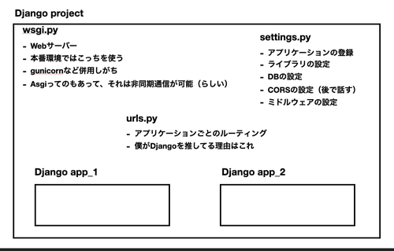

# こんにちは
こんにちは、こんばんは、あるいはおやすみなさい。僕です。  
今日はDRFを布教します。みんな使って欲しいなあ。

# DRFとは？
これです。
[https://www.django-rest-framework.org/](https://www.django-rest-framework.org/)
  
みんな大好きDjangoでREST APIを実装することができるようにしたフレームワークです。  
通常のDjangoと比較すると以下のような感じになります。
- models.py、views.pyは同じ
- urls.pyの考え方も同じ、Djangoだとルーティング、DRFだとエンドポイントになる
- templatesがない。SPAを想定している設計のためレスポンスはhtmlではなくjsonになる　

めちゃくちゃ雑に言うと、templages/がなくなっただけみたいな。  

また、あとで説明しますが、勝手にRESTっぽくなります。  

# 全体像
まず全体像について。基本的にはMVCですがちょっとだけ異なるのがプロジェクトとアプリケーションの概念だと思います。  
Djangoではプロジェクトの中にアプリケーションが入っている状態です。プロジェクトとアプリケーションの関係は1対多です。DBはアプリケーションごとに管理されますが、実際には全て1つのデータベースに書き込まれます。  
図で表すと以下のような感じ。(どこかで使った画像)  Invalid response

  

また、アプリケーションの中身は以下のような感じになっています。  


それぞれ書いてある通りで、下でもちょこちょこ出てくるのでその都度確認してもらえればと思います。

# そもそもSPAサイトって何って人へ
自分で調べてください。


# 環境構築
以下のライブラリをインストールします。

```bash
pip install Django
pip install django-cors-headers
pip install djangorestframework
pip install django-filter
```

これらは必要最低限のライブラリなのでもう少し拡張したい人はその都度インストールが必要かもしれないです。
  
次にワークスペースを作成していきます。  
まずはプロジェクトの作成から。

```bash
django-admin startproject test_project
```

これでプロジェクトが作成されます。ここではtest_projectというプロジェクトを作成しています。  
次にアプリケーションを作成します。

```bash
cd test_project
django-admin startapp app
```

これでアプリケーションが作成されました。ここではappというアプリケーションを作成しました。  
これで準備は整ったので、次に最初の設定を行っていきます。  
Djangoではプロジェクトごとでアプリケーションを管理しているのでまずはアプリケーションの登録をします。    

```python
# settings.py
....


INSTALLED_APPS = [
    'django.contrib.admin',
    'markdownx', 
    'django.contrib.auth',
    'django.contrib.contenttypes',
    'django.contrib.sessions',
    'django.contrib.messages',
    'django.contrib.staticfiles', 
    'app',  # これを追加(自分のアプリケーション名)
    'rest_framework', # これを追加
    'corsheaders', # これを追加
]

....

MIDDLEWARE = [
    'django.middleware.security.SecurityMiddleware',
    'django.contrib.sessions.middleware.SessionMiddleware',
    'django.middleware.common.CommonMiddleware',
    'django.middleware.csrf.CsrfViewMiddleware',
    'django.contrib.auth.middleware.AuthenticationMiddleware',
    'django.contrib.messages.middleware.MessageMiddleware',
    'django.middleware.clickjacking.XFrameOptionsMiddleware',
    'corsheaders.middleware.CorsMiddleware', # これを追加
]

....


CORS_ORIGIN_ALLOW_ALL = True # これを追加

# 以下を追加
REST_FRAMEWORK = {
    'DEFAULT_PARSER_CLASSES': (
        'rest_framework.parsers.FormParser',
        'rest_framework.parsers.MultiPartParser', 
        'rest_framework.parsers.JSONParser',
     )
 }


```

こんな感じです。  
Djangoでは必要なアプリケーションやミドルウェアの設定はこのsettings.pyで行っています。ここでは自分のアプリケーションの登録、CORS対策のためのミドルウェアの導入、DRFの設定を行いました。もっと詳しく知りたい方は[ここらへん](https://github.com/adamchainz/django-cors-headers)を参照してみるといいかもしれません。


次にプロジェクト全体のルーティングを定義します。
ここではプロジェクトのルートに処理が来たときにappの中のurls.pyに処理を飛ばすことを宣言しています。app/urls.pyはあとで定義します。
  
```python
# test_project/test_project/urls.py
from django.contrib import admin
from django.urls import path, include

urlpatterns = [
    path('', include('app.urls')), 
]

```

# やっと開発
ここまで長かったですね。Djangoはここら辺の設定でつまづく人も多いので大変です。ここまで来れたあなたはえらい！頑張っていきましょう。


## モデルの作成
アプリケーションにはデータベースがつきもの！そうですよね？(知らんわ、そうでもないだろ)    
Djangoではモデルの定義はPythonのコードで行います。どこぞのRailsとは違って見やすいですし、マイグレーションの管理もしやすいです。  
  
また、Djangoにはコマンドがいくつかあります。マイグレーション周りだと以下のようなものがあります。

- マイグレーションファイルを作成する
  - python manage.py makemigrations
- マイグレーションする
  - python mange.py migrate
- 現在のマイグレーションを確認する
  - python manage.py showmigrations

ここら辺が良く使うと思います（主観）  
  
  

マイグレーションについてですが、以下のような仕組みになっています。  
上で示した通りです。makemigrationsとmigrateを二段階で実装することによってデータベースに書き込まれます。


ではでは、モデル定義をしていきましょう。今回はリレーション持たせたいとかいう願望のため、1個だけ外部キーを持っています。お許しあれ。

```python
# app/models.py

from django.db import models

class Human(models.Model):
    name = models.CharField(max_length=255)
    age = models.PositiveIntegerField()
    job = models.ForeignKey('Job', on_delete=True)

class Job(models.Model):
    name = models.CharField(max_length=255)
    contents = models.TextField(max_length=65535)
    def __str__(self):
        return str(self.name)
```


今回は、日本国憲法第二十七条一項に「すべて国民は、勤労の権利を有し、義務を負う」とあるので人間というモデルとお仕事というモデルを作成しました。こんなこと言うと叩かれそうなのでWorkではなくJobにしました。Workよりも軽い感じしてるかなみたいな？（知らんけど（まじで知らん）
  
モデルの説明はまあ見りゃわかるかなと思うので割愛します。普通にDBで使える型は全部使えます。DBによって異なりますが、いい感じに格納してくれます（MySQLのBooleanみたいなやつもあるけどTrue/Falseで渡して問題なし）  

さあ、マイグレーションをしてみましょう。  
```bash
python manage.py makemigrations
python manage.py migrate
```

これでいい感じになれば成功です！  

## データベースに値を突っ込む
やっぱり作ったデータベースには値を入れたいですよね、わかる。  
てことで突っ込んじゃいましょう！2つ方法がありますがどうします？え、CUIがいい？おけまる！  

```bash
python manage.py shell
```

こやつを入力するとipythonが開きます。ここで作業しましょう。  
ここではクラスのインスタンスを作成して突っ込むみたいなイメージです。  
まずは外部キーであるJobから作りたみがありますね。  
 

```python
In [1]: from app.models import Human, Job

In [2]: job = Job(name='student', contents='Student')

In [3]: job.save()
```

ニートだけど学生って名乗っちゃった！ちなみにjobに代入するところではトランザクションが開いています。save()をすることでコミットされて無事トランザクションが終了します。  

次にHumanを作成します。  
```python
In [4]: human = Human(name='takurinton', age=20, job=job)

In [5]: human.save()
```

これで僕の情報が保存されました。  
確認してみましょう。

```python
In [6]: human
Out[6]: <Human: Human object (4)>

In [7]: human.name
Out[7]: 'takurinton'

In [8]: human.age
Out[8]: 20

In [9]: human.job
Out[9]: <Job: student>
```

良さそう！！！！ちなみに参照はobject.valueで参照することができます！

## エンドポイントの作成
RESTフレームワークたるもの、エンドポイントは必須です。GraphQLが好きな方は出て行ってください。ここにはたくさんのエンドポイントがある。  

てことで作っていきます。  
Djangoにはデフォルトでアプリケーションの中にurls.pyが存在しないので自作します。
```
pwd
>>> your/workspace/path/test_project/app
touch urls.py
```

よきまる！  
ここに以下を記述します。
Djangoはsettings.pyで定めたエンドポイントにリクエストがきたら対象となるurls.pyの中からurlpatternsを見つけ、そこのpathという関数から参照するコントローラーを探します。
ちなみにpathの引数は
```
path(エンドポイント, 呼び出す関数またはクラス)
```

となっています。DRFではクラスを使用することが多いです。as_view()は深く考えなくて良いでしょう。（初心者向けの記事なので）
エンドポイントを作成していきます。

```python
# app/urls.py

from django.urls import path, include
from . import views

urlpatterns = [
    path('', views.IndexView.as_view()), 
]
```

これでエンドポイントを作成しました。

## 処理をする部分の作成
最後に処理をする部分を書いていきましょう。ここまで長かったですね、書くの疲れました。何文字あるんだろう。word持ってないのでわかりまてん。  
ここではviews.pyというところでJSONを返す処理を書いていきます。  
今回は先ほど登録したHumanの情報を返すだけのエンドポイントを作成します。

```python
# app/views.py

from .models import Human

from rest_framework import status # ステータスコードを返す
from rest_framework.response import Response # リストをresponse型にラッピングする
from rest_framework.views import APIView # 汎用的に使えるView、僕はこれが一番好きだけど種類もっとたくさんあるよ

class IndexView(APIView):
    def get(self, request) -> Response:
        try:
            human:Human = Human.objects.all()

            # レスポンスをリスト内包表記で回す
            human_response = [
                {
                    'name': i.name, 
                    'age': i.age, 
                    'job': i.job.name, 
                }  
                for i in human
            ]

            return Response(human_response) # JSONが返る
        except:
            return Response(status=status.HTTP_500_INTERNAL_SERVER_ERROR)
```

こんな感じです。必要なことはコメントに書きました。
これで準備は完了です！

## ブラウザでレスポンスを確認する
ここまでよくやりました。あなたはとっても優秀です。今宵はシャンパンを開けましょう！（オライリー風）  

コマンドラインで以下のコマンドを実行します。
```bash
python manage.py runserver
```

そして [http://127.0.0.1:8000/](http://127.0.0.1:8000/)にアクセスして先ほど入れたデータベースの中身がJSONで返ってくればおけまる！
大成功です！


## 補足
現状のコードはめちゃくちゃ簡単に実装しただけのものになります。特にAPIViewに関してはあと7種類くらい？あったはずなのでそれを使用してみるのもいいかもしれません。今回の僕の実装は本当に最低限を貫いたものなので何もないです。  
また、今回はgetリクエストだけでしたが、この他にも一般的なHTTPリクエストのメソッドを投げることができ、それをクラスの中に複数定義することができます。1エンドポイントに対して1クラスということは、1つのクラスに複数のメソッドを記述することでRESTっぽく書くことができます。また、エンドポイントに引数を渡すことも可能です。このように無限の可能性を秘めたDRF、みなさん一度試してみてください！  

## 補足2
これ現状のコードだとjobのところでN+1問題が起きてます。やるなら、SQL文べた書きした方がいいかも？  
```
DB.objects.raw()
```
ってのがあるのでもし興味があれば！

# まとめ
いかがでしたか、DRF、深夜に書いてるので意識が朦朧としてます。明日テスト生きて帰ってこれるかなあ、、、。では。
EOFエラー出てます。誰か見つけてね。
