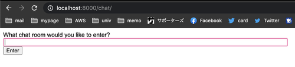

# こんにちは
どうも、僕です。今回はDjangoでasgiを使用してみたということでチュートリアルを自分なりにまとめたいと思います。最近のブログ暇つぶしみたいな感じだったので今回は久しぶりに新しい技術に触れたアウトプット感があって良きです。浅い


# asgiって何？
まず最初にasgiについて説明したいと思います。そもそもPythonで鯖を立てるためにはwsgiとasgiの2種類があります。  

- wsgi
  - これまで一般的に使われてきたPythonの鯖
  - 強い
  - gunicornなどと一緒に使うことができる
- asgi
  - wsgiに加えて非同期通信を実現したもの
  - なんか強いらしい
  - Websocketはそのままでは使えないっぽい
  - Django3.0から正式にサポートされた

てな感じです。従来のwsgiとの一番大きな違いは非同期通信をすることができることでしょうか。  
もし情報を保存しない場合はpeer to peerでフロントエンドだけで完結させるパターンも多いですが、鯖で管理したいならこっちでしょう。これをすることで某ユッキーナのラインの流出も可能になるわけです。  

# 実装してみる
Djangoで非同期通信ができるっぽいのでDjango channelsというやつを使って実装してみたいと思います。  
今回の目標としては、メッセージの送受信をすることができるようになるということです。それ以上の拡張についてはこの記事を書き終わったらやります。気が向いたらそれも記事にします。  

# プロジェクトとアプリケーションの作成
普通にやります。

```bash
django-admin startproject asgi_test
cd asgi_test
django-admin startapp chatapp
```

良き。これでいい感じに環境を作ることができます。  

# 設定をいじる
次にsettings.pyを触っていきます。  
以下の点を変更します。

```python
... 
INSTALLED_APPS = [
    'django.contrib.admin',
    'django.contrib.auth',
    'django.contrib.contenttypes',
    'django.contrib.sessions',
    'django.contrib.messages',
    'django.contrib.staticfiles',
    'chatapp',  # これを追加
    'channels', # これを追加
]
...

ASGI_APPLICATION = 'asgi_test.asgi.application' # これを追加
# WSGI_APPLICATION = 'asgi_test.wsgi.application' これをコメントアウトか消すかする

...
```

こんな感じです。変更点としては、いつも通りアプリケーションを追加しますが、先ほど言ったようにchannelsを使用するのでそれも追加します。  
さらにwsgiではなくasgiを使用するのでここも変更しておきます。これでrunserverしたときに実行される鯖がwsgiからasgiに変わります。

# ルーティング
まずはDjangoの基本的なルーティングについてやっていきます。  
自分はurls.pyではなくroute.pyと最近だと書いてるのでこっちでやっていきます。

```python
# asgi_test/route.py
from django.contrib import admin
from django.urls import path, include

urlpatterns = [
    path('chat/', include('chatapp.route')), 
    path('admin/', admin.site.urls),
]
```

```python
# chatapp/route.py
from django.urls import path

from . import controller

urlpatterns = [
    path('', controller.index),
    path('<str:room_name>/', controller.room), 
]
```

こんな感じでいつも通り適当にルーティングしていきます。また、views.pyはcontroller.pyとして定義していきます。  

```python
# chatapp/controller.py
from django.shortcuts import render

def index(request):
    return render(request, 'index.html')

def room(request, room_name):
    return render(request, 'room.html', 
        {
            'room_name': room_name
        }
    )
```

こんな感じでやっていきます。今回はhtmlを返します。JSONではないです。厚切りの方のJSONの仕事が減りそうですね。  

# 画面を作る

このままではエラーになってしまうのでhtmlを追加します。  

```bash
mkdir templates
touch index.html
touch room.html
```

作成しました。index.htmlはトップ画面、room.htmlはチャットするお部屋です。  
ちょっとだけ書いていきます。  

```html
// index.html

<!DOCTYPE html>
<html>
<head>
    <meta charset="utf-8"/>
    <title>Chat Rooms</title>
</head>
<body>
    What chat room would you like to enter?<br>
    <input id="room-name-input" type="text" size="100"><br>
    <input id="room-name-submit" type="button" value="Enter">

    <script>
        document.querySelector('#room-name-input').focus();
        document.querySelector('#room-name-input').onkeyup =(e) => {
            if (e.keyCode === 13) {  
                document.querySelector('#room-name-submit').click();
            }
        };

        document.querySelector('#room-name-submit').onclick =(e) => {
            var roomName = document.querySelector('#room-name-input').value;
            window.location.pathname = '/chat/' + roomName + '/';
        };
    </script>
</body>
</html>
```
  
ここではトップ画面を定義しています。inputタグの中身に部屋の名前を入れてクリックすると部屋が作成されそこに飛びます（この時点で中身に値を入れてとんでもエラー）  
また、DBなどは作成していないので部屋の内容は保存されません、ここに関しては後日拡張します。

次にroom.htmlを書いていきます。

```html
// room.html
<!DOCTYPE html>
<html>
<head>
    <meta charset="utf-8"/>
    <title>Chat Room</title>
</head>
<body>
    <textarea id="chat-log" cols="100" rows="20"></textarea><br>
    <input id="chat-message-input" type="text" size="100"><br>
    <input id="chat-message-submit" type="button" value="Send">
    {{ room_name|json_script:"room-name" }}
    <script>
        const roomName = JSON.parse(document.getElementById('room-name').textContent);

        const chatSocket = new WebSocket(
            'ws://'
            + window.location.host
            + '/ws/chat/'
            + roomName
            + '/'
        );

        chatSocket.onmessage = (e) => {
            const data = JSON.parse(e.data);
            document.querySelector('#chat-log').value += (data.message + '\n');
        };

        chatSocket.onclose =(e) => {
            console.error('Chat socket closed unexpectedly');
        };

        document.querySelector('#chat-message-input').focus();
        document.querySelector('#chat-message-input').onkeyup = function(e) {
            if (e.keyCode === 13) {  // enter, return
                document.querySelector('#chat-message-submit').click();
            }
        };

        document.querySelector('#chat-message-submit').onclick =(e) => {
            const messageInputDom = document.querySelector('#chat-message-input');
            const message = messageInputDom.value;
            chatSocket.send(JSON.stringify({
                'message': message
            }));
            messageInputDom.value = '';
        };
    </script>
</body>
</html>
```
  
ここではチャットをするためのソケットを開きます。  
textに値を入れてボタンを押すとメッセージが表示されます。送られたメッセージは同じ部屋にいる相手に届きます。  
処理はJSで実装していて、それぞれのイベントが起きたときの処理を書いています。  
ここにユーザー情報でも付与して可愛くすればいい感じになりそうですね。拡張のしがいがある！！！  
この時点ではここはまだ動きません。ですがちょっと1回だけ動作確認します。


```bash
python manage.py runserver
```
これを実行して [http://localhost:8000](http://localhost:8000)にアクセスします。  



こんな画面が表示されればOK！！  
まだここに何か入れてもエラー出るだけなので注意してください！  

# 部屋を作ってチャットができるようにする
ここからが本番ですよね(๑˃̵ᴗ˂̵)
バックエンド側で処理することができるようにします！  

まずはconsumers.pyを定義します。

```python
# chatapp/consumers.py
import json
from asgiref.sync import async_to_sync
from channels.generic.websocket import WebsocketConsumer


class ChatConsumer(WebsocketConsumer):
    # 接続周りの関数
    def connect(self):
        self.room_name = self.scope['url_route']['kwargs']['room_name']
        self.room_group_name = 'chat_%s' % self.room_name

        # 部屋に入ったとき
        async_to_sync(self.channel_layer.group_add)(
            self.room_group_name,
            self.channel_name
        )

        self.accept()

    def disconnect(self, close_code): 
        # 部屋から抜けたとき
        async_to_sync(self.channel_layer.group_discard)(
            self.room_group_name,
            self.channel_name
        )

    # メッセージ関連の関数
    def receive(self, text_data):
        text_data_json = json.loads(text_data)
        message = text_data_json['message']

        # メッセージを送ったとき
        async_to_sync(self.channel_layer.group_send)(
            self.room_group_name,
            {
                'type': 'chat_message',
                'message': message
            }
        )

    # メッセージを受け取ったとき
    def chat_message(self, event):
        message = event['message']

        # ソケットに送る
        self.send(text_data=json.dumps({
            'message': message
        }))
```

ここではそれぞれ接続されたときとメッセージの送受信があったときの定義をしています。全てWebsocketConsumerクラスを継承して定義しています。　　
例えばdef connect(self):の中身は以下のようになっています。

```python
def connect(self):
        self.accept()

    def accept(self, subprotocol=None):
        """
        Accepts an incoming socket
        """
        super().send({"type": "websocket.accept", "subprotocol": subprotocol})

```  

ただコネクトするだけみたいになっていますね。sendという関数がいい感じにしてくれてるみたいです。ここに名前などを定義して乗せてるというイメージで良さそうですね。


あとこれどれくらいの負荷に耐えられるのか気になりますね。  
  
ちなみにSkywayとかgorilla/mux routerとか使ったことある人は似たような感じの実装になると思うのでなんとなく意味はわかると思います。

  
次にrouting.pyを定義します。

```python
# chatapp/routing.py

from django.urls import re_path

from . import consumers

websocket_urlpatterns = [
    re_path(r'ws/chat/(?P<room_name>\w+)/$', consumers.ChatConsumer.as_asgi()),
]
```

ここではre_path関数を使用してリダイレクトされるように記述しています。  
部屋が新規作成されたときに動的に変換するためです。    
   
as_asgi()がなんなのか気になりますか？自分も気になったのですが、as_view()と同じ感じっぽいです。なるほど。サポートが手厚くなってる、これがフォーマルなサポートか。。。


次にasgi.pyをいじります。  

```python
# asgi_test/asgi.py
import os

os.environ.setdefault('DJANGO_SETTINGS_MODULE', 'asgi_test.settings')

from channels.auth import AuthMiddlewareStack
from channels.routing import ProtocolTypeRouter, URLRouter
from django.core.asgi import get_asgi_application 
import chatapp.routing

application = ProtocolTypeRouter({
  "http": get_asgi_application(),
  "websocket": AuthMiddlewareStack( # ソケットを使うための定義, デフォルトだと使用不可らしい
        URLRouter(
            chatapp.routing.websocket_urlpatterns # route
        )
    ),
})
```

ここでは、ソケットを使用することができるようになっています。AuthMiddlewareStackを使用してソケットのアクセスを許可しています。

  
最後にsettings.pyをいじります。  

```python
# wsgi_test/settings.py

# channelsを使用するための設定を追加
CHANNEL_LAYERS = {
    'default': {
        'BACKEND': 'channels_redis.core.RedisChannelLayer',
        'CONFIG': {
            "hosts": [('127.0.0.1', 6379)],
        },
    },
}
```

ここではソケット用のポートを開いています。  
ポートがこのままでは存在しないので作ります。

以下のコマンドを実行します。

```bash
docker run -p 6379:6379 -d redis:5
```

これでおけまるです。

# 動作確認

```bash
python manage.py runserver
```

改めてアクセスします。  
  

また入力画面が出てくるので適当な名前を入れてenterを押します。ここではdemoroomを入力しました。  

enterを押すと部屋が作成されました！  

良さそう！

次にもう1つブラウザを開き同じURLにアクセスします。  


こんな感じ〜〜  
次に適当にメッセージを送ってみます。
  


おおおおおおお！！良き！共有できた！hogehogeが共有された！  

# まとめ
今回はPythonを使用して（Djangoか）非同期通信を行う実装を行いました。  
また、wsgiとasgiの違いも認識することができました。今まで存在は知っていたけどなんだろうと思っていたものを解明することができてよかったです。  
今後はユーザーのテーブルを作成して簡単なチャットアプリを作成して実際に使ってみたいなとか思っています。asgi、これからDjangoを使っていく上で手放せない存在になりそう（小並感）  
今後もどんどんDjangoを使用して動的なアプリケーションを作成していきたいと思いました！以上！

# 追記

ログはこんな感じで残っていました。
ハンドシェイクしてコネクトしてって感じの普通の流れですね（そりゃそうだろ ）  
ポートはソケットとhttpでそれぞれ違うみたいな感じか。あんまよく理解してないなワイ、、、。
```
HTTP GET /chat/demoroom/ 200 [0.02, 127.0.0.1:56379]
WebSocket HANDSHAKING /ws/chat/demoroom/ [127.0.0.1:56382]
WebSocket CONNECT /ws/chat/demoroom/ [127.0.0.1:56382]
HTTP GET /chat/demoroom/ 200 [0.01, 127.0.0.1:56379]
```
