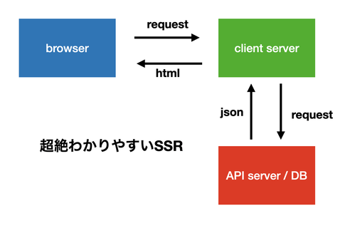

# こんにちは
どうも，ぼくです．  
久しぶりにブログ書いてる，日本語死んでそう．  
今回はSSRについての記事です．頑張るぞ〜


# 前提
ここしっかり書いとかないと解釈違いとかで怒られそうなので書いておきます．

- この記事はSSRを理解するためのもの
- First Viewは初期表示のことをいう，細かい分類はしない，レンダリングした結果がブラウザに表示されたタイミングのこと
- preactとfastifyを使用している
- コードは[これ](https://github.com/takurinton/preact-fastify-ssr)
- 超簡単な構成
- create react appでReactの開発経験がある，webpackやbabelを少しだけ知ってる人向け
- SSRという言葉は聞いたことあるけど何やってるのかわからない人向け


# preactとfastifyについて
preactはReactの軽量なライブラリとして，fastifyはexpressよりも速く動作するライブラリとして親しまれています．  
それぞれのライブラリについての詳しい説明はあとで別の記事にして公開する予定なので今回は触れません．React + express で作ってるのとあまり変わらんくらいの感じで見てもらえればいいかなと思います．

# SSRとは
まずはサーバサイドレンダリングについてです．  
サーバサイドレンダリングについてのブログや記事などは世の中に転がっていますがpreactとfastifyで行っている記事はあまり見かけませんでした．  
また，実装以前に概念の部分であまり理解できないと感じた部分がちょこちょこあったのでそこらへんに注意しながら書いていきたいと思います．

## 具体的に何をしてるの？
一言で言うと，htmlを生成する作業がメインです．  

ただ，そもそもここがわからなかった．  
SSRと一口に言っても，サーバサイドってどこのサーバのことなのか，バックエンドとは何が違うのかがあまり理解できませんでした．  


簡単な図で表すとこんな感じになります．
要はクライアントサーバがあって，場合によってはそこからDBにfetchしたりAPIサーバを叩いたりするという感じです．  


つまり，バックエンドの言語は別で書いていたりするケースもあり，サーバサイドレンダリングしてるからSPAではないとは言えないわけです．  
  
また，今回の実装に当てはめるとこのような形になります．  
このようにfastifyで立てたサーバに対してpreactを噛ませてるイメージです．  
fastifyはhtmlを組み立ててブラウザに返しています．このためクローラーはJSを叩かなくても既に組み立てられたhtmlがあるのでSEO対策になったり初期レンダリングが速くなるという仕組みです．


次にfastifyとpreactのそれぞれの役割についてのイメージはこんな感じになっています．  


これらの全体のワークフローはこんな感じです．  
場合によってはここにAPIを叩いたりする工程が入ります．  
基本的なSSRはこんな感じで組み立てています．  


## デメリットはあるのか
もちろんあります．  
そもそもブラウザで動作するレンダリングエンジンはVueやReactなどのJSで動いていますがそれをサーバで動かそうとするとNodeを使うことになります。    
そうなるとメインループをブロックしてしまうことが多々あるため，CPUにかかる負荷が多くなってしまいます．  
SSRをしなくてもprefetchという手法があったりするので必ずしもこれが正義というわけではなくなってきます．  


# 実装してみる
上で説明したことをコードにしてみたいと思います．  
今回はwebpackとbabelを使用してbuildをしていきたいと思います．

## webpackとは
[この記事](https://qiita.com/kamykn/items/45fb4690ace32216ca25)がわかりやすかったです．

## babelとは
[この記事](https://qiita.com/Shagamii/items/a87181c22ea777ee2acc)がわかりやすかったです．

## 設定ファイル
設定ファイルを書いていきます．  
まずはpackage.json

```json
// package.json
{
  "scripts": {
    "start": "npm run build && npm run dev",
    "dev": "node ./dist/server/server.js",
    "build": "npm run build:client && npm run build:server",
    "build:client": "webpack --config webpack.config.js --mode development",
    "build:server": "babel src --config-file ./babel.config.js  -x '.ts,.tsx' -d dist"
  },
  "author": "",
  "license": "ISC",
  "devDependencies": {
    "babel-core": "^6.26.3",
    "babel-loader": "^8.2.2",
    "babel-plugin-transform-react-jsx": "^6.24.1",
    "babel-preset-env": "^1.7.0",
    "ts-node": "^9.1.1",
    "typescript": "^4.1.3",
    "webpack": "^4.44.2",
    "webpack-cli": "^3.2.1",
    "webpack-dev-server": "^3.1.14"
  },
  "dependencies": {
    "@babel/cli": "^7.12.10",
    "@babel/core": "^7.12.10",
    "@babel/plugin-transform-react-jsx": "^7.12.12",
    "@babel/preset-env": "^7.12.11",
    "@babel/preset-react": "^7.12.10",
    "@babel/preset-typescript": "^7.12.7",
    "fastify": "^3.11.0",
    "fastify-static": "^3.4.0",
    "node-fetch": "^2.6.1",
    "preact": "^10.5.7",
    "preact-compat": "^3.19.0",
    "preact-render-to-string": "^5.1.12",
    "ts-loader": "^8.0.12"
  }
}
```

こんな感じです．webpack, babel, fastify, preact, ts-loaderあたりがメインになっています．  
上を書いてから  

```bash
npm i
```

これでパッケージはオッケーです．  
つぎにtsconfig.jsonです．  
注意すべき点はjsxFactoryにh関数を指定することです．ここでhを指定することによってpreactを使用することができるようになります．

```json
// tsconfig.json
{
    "compilerOptions": {
      "jsxFactory": "h", // preactを使うための宣言
      "target": "es5",
      "module": "commonjs",
      "jsx": "react",
      "strict": true,
      "esModuleInterop": true,
      "skipLibCheck": true,
      "forceConsistentCasingInFileNames": true
    }, 
    "include": [
     "src"
    ],
    "exclude": [
      "node_modules"
    ]
}
```

つぎにbabelの設定をしていきます．  
ここでもpluginとしてh関数を指定していきます．

```js
// babel.config.js

module.exports = {
    presets: [
      "@babel/preset-react",
      [
        "@babel/preset-env",
        {
          targets: {
            node: "current",
          },
        },
      ],
      "@babel/preset-typescript"
    ],
    plugins: [
      [
        "transform-react-jsx",
        {
          "pragma": "h" // preactを使うためにはここでhを使う宣言をしないといけない
        }
      ], 
    ]
  };
```

最後にwebpackの設定です．今回はCSSを使わないので何も指定していませんが，使用する場合はここに記述してください．

```js
// webpack.config.js

const path = require('path');

module.exports = {
  mode: 'production',
  target: 'web',   // ブラウザ上で動作するための設定
  entry: './src/client/app.tsx',   // エントリポイント，ここではapp.tsxで呼び出す
  output: {
    path: path.resolve(__dirname, 'assets'), // buildした際の出力先
    filename: '[name].js'  // buildした際の出力するjsのファイル名．[name]にするとそのファイルの名前になる
  },
  devServer: {
    port: 3000,
    contentBase: 'dist', 
    historyApiFallback: true,
  },
  resolve: {
    extensions: ['.js', '.jsx', '.tsx'], // 許可する拡張子
  },
  module: {
    // buildするルールを指定
    rules: [
      {
        test: /\.ts(x?)$/,
        use: [
          // 使用するローダーを指定
          "babel-loader",
          {
            loader: "ts-loader",
            options: {
              transpileOnly: true,
              configFile: "tsconfig.json",
            },
          },
        ]
      }
    ]
  }
};
```

これで設定ファイルは完了です．  

# 共通で使うコンポーネントの定義
まずは全体で共通で使うコンポーネントの定義をしていきます．  
具体的にはserverで動くやつとclientのルーティングとhtml, head, bodyなどの外側を囲うファイルの定義です．  
やっていきます

## Html.tsxとserver.tsxの実装
まずはサーバサイドから実装していきます．  
サーバサイドではpreactのコンポーネントを基にstringのhtmlを生成してレスポンスを返します．  
preactのコンポーネントからstringのhtmlを生成する関数として `preact-render-to-string` の `render` を使用します．  
また，その外枠の共通部分を指定するコンポーネントとして先に `Html.tsx` を定義します．  

```ts
import { h, JSX } from 'preact';
/** @jsx h */

interface Props {
    children: () => JSX.Element;
    title: string;
    image: string,
    discription: string
    props?: any;
}

const Head = (props: Props) => {
    return (
        <head>
            <link rel="preconnect" href="https://ssr-test.takurinton.vercel.app/" />
            <title>{props.title}</title>
            <meta charSet="utf-8" />
            <meta name="description" content={props.discription} />
            <meta property="og:title" content={props.title} />
            <meta property="og:description" content={props.discription} />
            <meta property="og:type" content="blog" />
            <meta property="og:url" content="https://www.takurinton.com" />
            <meta property="og:image" content={props.image} />
            <meta property="og:site_name" content={props.title} />
            <meta name="twitter:card" content="summary_large_image" />
            <meta name="twitter:url" content={props.image} />
            <meta name="twitter:title" content={props.title} />
            <meta name="twitter:description" content={props.discription} />
            <meta name="twitter:image" content={props.image} />
            <link rel="shortcut icon" href={"https://www.takurinton.com/me.jpeg"} />
            <link rel="apple-touch-icon" href={"https://www.takurinton.com/me.jpeg"} />
            <link rel="stylesheet" href="//cdnjs.cloudflare.com/ajax/libs/highlight.js/9.6.0/styles/solarized-dark.min.css" />
            <meta name="viewport" content="width=device-width,initial-scale=1" />
            <style>
            {`
                body {
                    padding: 0; 
                    margin: 0;
                    margin-bottom: 50px;
                    text-align: center;
                    font-family: Helvetica Neue, Arial, Hiragino Kaku Gothic ProN, Hiragino Sans, Meiryo, sans-serif;
                }
                @media (max-width: 414px) {
                    font-size: 80%;
                }
            `}
            </style>
      </head>
    )
}

export const Html = (props: Props) => (
    <html lang="ja">
        <Head {...props} />
        <body>
            <div id="main">
                <props.children {...props.props} />
            </div>
            <script id="json" type="text/plain" data-json={ JSON.stringify(props.props) }></script>
            <script async defer src={`http://localhost:3000/main.js`} />
        </body>
    </html>
);

```

こんな感じ．  
propsには動的に変えたい要素を渡すようにしています．また，`<script async defer src={`http://localhost:3000/main.js`} />` でbuildしたあとのpreactのコードを読み取るようにしています．  
また，htmlにJSONを埋め込むことによってこの後に登場するclient sideでのルーティングで楽に処理をすることができるようになります．

  
つぎに `server.tsx` を定義して fastify を利用します．

```ts
import fastify, { FastifyRequest, FastifyReply } from "fastify";

const fastifyStatic = require('fastify-static');
const path = require('path');

import { Html } from './Html';
import { Home } from '../client/components/pages/Home';
import { About } from '../client/components/pages/About';
import { Posts } from '../client/components/pages/Posts';
import { Post } from '../client/components/pages/Post'

import render from "preact-render-to-string";

import fetch from 'node-fetch';


const app = fastify();
app.register(fastifyStatic, {
    root: path.join(process.cwd(), 'assets')
})

app.get('/', (req: FastifyRequest, res: FastifyReply) => {
    const renderd = Html({
        children: Home,
        title: 'home',
        discription: 'hogehoge', 
        image: 'https://www.takurinton.com/me.jpeg', 
        props: {},
    });
    const html = render(renderd)
    // res.raw.write('<!DOCTYPE html>')
    res.type('text/html')
    res.send(html)
});

app.get('/about', (req: FastifyRequest, res: FastifyReply) => {
    const renderd = Html({
        children: About,
        title: 'about',
        discription: 'about', 
        image: 'https://www.takurinton.com/me.jpeg', 
        props: {},
    });
    const html = render(renderd)
    // res.raw.write('<!DOCTYPE html>')
    res.type('text/html')
    res.send(html)
});

app.get('/posts', (req: FastifyRequest, res: FastifyReply) => {
    const id: string = (req.params as { id: string }).id;
    fetch(`https://api.takurinton.com/blog/v1/`)
    .then(res => res.json())
    .then(json => {
        const renderd = Html({
            children: Posts,
            title: 'blog posts',
            discription: 'blog posts', 
            image: 'https://www.takurinton.com/me.jpeg', 
            props: json,
        });
        const html = render(renderd)
        // res.raw.write('<!DOCTYPE html>')
        res.type('text/html')
        res.send(html)
    })
    .catch(err => {
        res.type('text/html')
        res.send(err)
    });
});

app.get('/post/:id', (req: FastifyRequest, res: FastifyReply) => {
    const id: string = (req.params as { id: string }).id;
    fetch(`https://api.takurinton.com/blog/v1/post/${id}`)
    .then(res => res.json())
    .then(json => {
        const renderd = Html({
            children: Post,
            title: json.title,
            discription: json.title, 
            image: 'https://www.takurinton.com/me.jpeg', 
            props: json,
        });
        const html = render(renderd)
        // res.raw.write('<!DOCTYPE html>')
        res.type('text/html')
        res.send(html)
    })
    .catch(() => {
        res.type('text/html')
        res.send('error')
    });
});

app.listen(3000);
```

こんな感じです．   
先ほど定義した `Html.tsx` はこのようにして使用します．

```ts
const renderd = Html({
        children: Home, // コンポーネント
        title: 'home', // title
        discription: 'hogehoge', // SEO用の文字 
        image: 'https://www.takurinton.com/me.jpeg',  // OGPなどに使用する画像．またはfavicon
        props: {}, // props
    });
```

また，必要があればpropsに値を渡すことができます．
つぎにクライアントサイドの処理を書いていきます．

## app.tsx
ここではクライアントサイドのレンダリングを行っています．  
SSRではserver sideで生成されたhtmlとclient sideで生成されたhtmlが同一のものであることが保証されていなければならず，これは言葉の使い方が合っているかどうかは知りませんが冪等性と呼ばれています．  
そのため，クライアントサイドではrenderingではなくhydrationをする必要がありますがpreactではDOMを持たないためrenderで対処していきます．

```ts
import { h, render } from "preact"
import { Router } from './Router'

render(<Router />, document.body)
```

## Route.tsx
ここではクライアントサイドのルーティングをしていきます．  
Routerに渡すのはhydrationしたいコンポーネントなのでそれをページごとで切り替える必要はあります．  
Routerは簡単な実装なのでSwitch文で実装しました．  

```ts
import { h } from 'preact';

import { Home } from './components/pages/Home'
import { About } from './components/pages/About'
import { Post } from './components/pages/Post';
import { Posts } from './components/pages/Posts';

export const Router = () => {
  const Component = () => {
    const path = window.location.pathname.split('/')[1]; // 苦しい
    const json = JSON.parse(document.getElementById('json').getAttribute('data-json'));
    switch(path) {
      case '':
        return <Home />;
      case 'about':
        return <About />
      case 'posts':
        return <Posts {...json} />;
      case 'post':
        return <Post {...json} />;
      default:
        return <h1>page not found</h1>;
    }
  }

  return <Component />
}
```

# ページコンポーネントの定義
次に各ページを作るコンポーネントの定義をしていきます．  

各ページではこんなものを実装します．

- Home.tsx：ホーム
- About.tsx：hooksを使ったカウンター
- Posts.tsx：ブログの最新の投稿5件
- Post.tsx：ブログの記事閲覧

です．

特別なことはしていないのでサクッといきます．


Homeではメインのページを作っています．中身はないです．

```ts
// Home.tsx

import { h } from 'preact';
/** @jsx h */

export const Home = () => (
    <div>
        <h1>hello world</h1>
        <h2><a href="/about">about</a></h2>
        <h2><a href="/posts">blog</a></h2>
    </div>
)
```

Aboutではhooksが使えるかどうかを試しています．  
preactではpreact/hooksを使用するとReactのhooksと同様のことができます．  
ここではよく見るカウンターを実装してみました.

```ts
// About.tsx

import { useState } from 'preact/hooks';
import { h } from 'preact';
/** @jsx h */

export const About = () => {
    const [count, setCount] = useState(0);
    return (
        <div>
            <h1>hello about</h1>
            <h2><a href="/">home</a></h2>
            <br/>
            <h1>{ count }</h1>
            <button onClick={() => setCount(count+1)}>click me!</button>
        </div>
    );
};
```

次にブログの一覧です．mapで要素を並べています．  
また，propsにはserver.tsxでfetchした内容を入れています．  

```ts
// Posts.tsx

import { h } from 'preact';
/** @jsx h */

interface PostsProps {
    next: string | null, 
    previous: string | null, 
    total: number, 
    category: any,
    current: number, 
    results: PostProps[], 
    page_size: string, 
    first: string, 
    last: string
}

interface PostProps {
    id: number,
    title: string, 
    category: string,
    contents: string, 
    contents_image_url: string,
    pub_date: string,
}

export const Posts = (props: PostsProps) => {
    return (
        <div>
            <h1>Blog Posts</h1>
            {
                props.results.map(post => ( <p><a href={`/post/${post.id}`}>{post.title}</a></p> ) )
            }
        </div>
    )
}
```

最後に投稿の内容の画面です．  

```ts
// Post.tsx

import { h } from 'preact';
/** @jsx h */

interface PostProps {
    id: number,
    title: string, 
    category: string,
    contents: string, 
    contents_image_url: string,
    pub_date: string,
    comment: CommentProps[]
}

interface CommentProps {
    name: string, 
    contents: string, 
    pub_date: string
}

export const Post = (props: PostProps) => {
    return (
        <div>
            <h1>{props.title}</h1>
            <p>{props.contents}</p>
        </div>
    )
}
```

今回扱うページのコンポーネントが出来上がりました．  
こんな感じで自作SSRは実装することができます．  

# 動作確認

動作確認をします．  
ターミナルから

```bash
npm start
```

をしましょう．

buildが走ってserver.jsを実行してくれたらブラウザで[localhost:3000](http://localhost:3000)にアクセスしてみましょう．


こんな感じでアクセスでき，それぞれのページに遷移することができればオッケーです．  
うまくいかない方は [ここにあるコード](https://github.com/takurinton/preact-fastify-ssr)をcloneして動作確認してみてください．  


# まとめ
今回は日本語が多かったので支離滅裂な部分や論理が飛躍してしまっている部分があるかもしれないですが許してください．  
また，何か間違ってる点などあったらご指摘お願いします．  
SSRは必ずしもベストプラクティスではありませんがこれからのフロントエンドでは必要な考え方（あとどれくらい続くかわからないけど）になってくるのでぜひ皆さんも一度実装してみてください！
