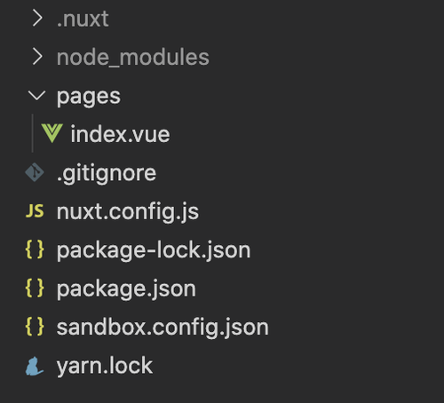

# はじめに
どうも，僕です．  
Nuxtに入門しました．よくわからないバグで昨日1日溶かしましたがまああれも経験ということで（元々使おうとしてたライブラリが某アダルトサイトの非公式ライブラリだったのでどこかがおかしかったのかも）  
ということで元々作ろうとしてたものに比べてだいぶ簡単な構成になってしまいましたがNuxtデビューブログを書いていきます．    
あと今回内容薄いので許してください．あくまでも入門です．

# 構成
全体の構成はこんな感じです．ツリー書くのめんどくさいのでスクショで許してください．  
リポジトリは[こちら](https://github.com/takurinton/nuxt_vite_suburi)  


  
  
結構個人的には最小構成にしたい人間なのでこんな感じでやってます．  

# 設定ファイル
まずは簡単に設定をしていきたいと思います．  

  
`package.json` には nuxt と build のために使用する nuxt-vite を入れます．  

```json
// package.json

{
  "scripts": {
    "dev": "nuxt dev",
    "build": "nuxt build",
    "start": "nuxt start"
  },
  "devDependencies": {
    "nuxt": "^2.15.2",
    "nuxt-vite": "^0.0.3"
  }
}
```

この状態で `npm i` をします．インストール完了です．  
nuxt-vite は vitejs を Nuxt で使用できるようにしたぷらぐいんです．  
vitejs に関しては後から記事にしますが，Rollupをベースとしたバンドル不要の高速で動作するビルドツールです．Anthony Fu さんが主に管理をしていて Vue の作者である Evan You さんが作成しました．    
  

次に `nuxt.config.js` を書いていきます．
ここでは先ほどインストールした `nuxt-vite` を使用することを定義しています．   

```js
// nuxt.config.js

export default {
  buildModules: [
    'nuxt-vite'
  ]
}
```
  
  
今回は定義ファイルはこれでおしまいです．webpack とか使ってごちゃごちゃしてる時から比較すると楽ですね．ただ，md を使用したい場合や css のフレームワークを使用したい場合には別途設定が必要になります．  
nuxt-vite は [vite-plugin-vue2](https://github.com/underfin/vite-plugin-vue2) に助けられたと言ってるのでコードを読んでみるのもありかなと思っています．  
  
# 見た目を書いていく
見た目と言っても今回は `index.vue` しか書いてません．  
簡単にしたいので僕のブログのくそAPIでも叩いてみたいと思います．  
レスポンスの形式がおかしいのは気にしないでください．修正しようと思って半年くらい経ちました．泣いた．  
  
  
こんな感じです．あまり変なことはしていなくて `asyncData` を使用してデータをとってきています．  
Nuxt には外部のデータをとってくる際に [fetch](https://ja.nuxtjs.org/docs/2.x/features/data-fetching/#fetch-%E3%83%95%E3%83%83%E3%82%AF) と [asyncData](https://ja.nuxtjs.org/docs/2.x/features/data-fetching/#async-data) の2種類があるのですが最初なんとなくしかわかっていなくて fetch を使っていたところ，Nuxt に知見のある友人からのアドバイスがあり asyncData に切り替えました．
そのほかは Vue のお作法と同じかと思います．  
  

```html
// index.vue

<template>
  <main>
    <br>
    <h2>{{ data }}</h2>
  </main>
</template>

<script>
export default {
  async asyncData() {
      const data = await fetch('https://api.takurinton.com/blog/v1/').then(res => res.json())
      return { data };
    }
}
</script>

<style scoped>
main {
  text-align: center;
}
</style>
```

# ちょっと脱線
結局 fetch と asyncData の違いはなんなのか  
ドキュメントには以下のようにあります．  
  
fetch の場合  

```
fetch はサーバーサイドレンダリングではコンポーネントのインスタンスが作成されたとき、クライアントサイドでは遷移するときに呼び出されるフックです。fetch フックは解決される promise を（明示的に、または async/await を使って暗黙的に）返却するべきです
```
  
asyncData の場合  

```
asyncData はユニバーサルなデータ取得のためのもう 1 つのフックです。非同期な状態を保存するために、コンポーネントのインスタンスにプロパティをセットする（または Vuex アクションをディスパッチする）必要がある fetch とは異なり、asyncData は単にその返却された値をコンポーネントのデータにマージします。以下は @nuxt/http ライブラリを使った例です
```

パッと見たところ，両方ともSSR次に外部のデータをフェッチするときに使用しますが，実際にはとってきたデータを store に入れてグローバルに参照できるようにするときなどに fetch を使い，今回のようなぺらいち（もしくはそのページコンポーネント内でしかデータを扱わない場合）には asyncData を使用すると良いということになります．  
つまり今回は asyncData がよかったということです．  


# まとめ
今回は Nuxt デビューをまとめました．  
また，nuxt-vite の素振りも兼ねていたので感覚が掴めてよかったです（最初に言ったように昨日は死んでましたが）  
普通に使う分には申し分ないくらいに使えますが，2日前にリリースされたばかりでまだまだバグだらけなので実用的ではありませんが逆にコントリビューションチャンスじゃんくらいのつもりで皆さん積極的に nuxt-vite，またついでに vitejs も使っていきましょう！  
では
