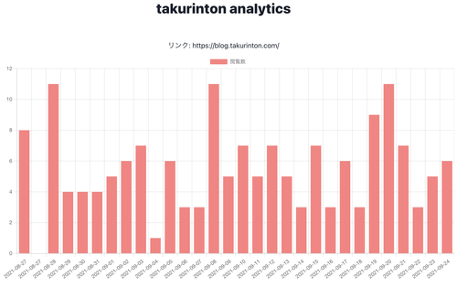

# こんにちは

どうも、僕です。  
この記事は [自サイトのアクセス可視化](https://blog.takurinton.com/post/78) の続きです。  
前回は AST をこねくり回して、form をいじる実装をしました。  
今回はそのアクセスごとの詳細画面を作成し、そこにグラフをつけて見やすくするみたいなことをしてみました。  
まだまだきれいではないのですが、これからきれいになります、きっと。

# 概要

前回、ちょっとだけ作っていた Detail.tsx を拡張します。  
詳細ページでは、クエリパラメータから、domain と path を取得して、その情報を使用してサーバサイドにリクエストを投げます。レスポンスには、その domain と path のアクセス情報と、日毎のアクセス回数が格納されていて、それを使用してグラフを作成します。  

# リクエストとレスポンス

GraphQL を使用します。  
query は以下のようになっています。  
domain には number、path には string を入れます。

```graphql
{
  analytics_by_path_for_blog(domain: 0, path: "") {
    count
    analytics {
      id 
      domain 
      path 
      created_at
    }
    date_count {
      date 
      count
    }
  }
}
```

レスポンスは以下のようになっています。  
ちょっと長いですが、analytics の部分はトップページの定義と同じ感じになっています。  
違う点として、date_count という key が増えました。ここには、アクセスした日と、その回数が格納されています。アクセスがない日には 0 が入っています。  
このデータを使用してグラフにします。


```json
{
    "data": {
        "analytics_by_path_for_blog": {
            "count": 1,
            "analytics": [
                {
                    "id": "1231",
                    "domain": "blog.takurinton.com",
                    "path": "/post/21",
                    "created_at": "2021-9-25",
                    "__typename": "AnalyticsType"
                }
            ],
            "date_count": [
                {
                    "date": "2021-08-27",
                    "count": 0,
                    "__typename": "DateCount"
                },
                {
                    "date": "2021-08-27",
                    "count": 0,
                    "__typename": "DateCount"
                },
                {
                    "date": "2021-08-28",
                    "count": 0,
                    "__typename": "DateCount"
                },
                {
                    "date": "2021-08-29",
                    "count": 0,
                    "__typename": "DateCount"
                },
                {
                    "date": "2021-08-30",
                    "count": 0,
                    "__typename": "DateCount"
                },
                {
                    "date": "2021-08-31",
                    "count": 0,
                    "__typename": "DateCount"
                },
                {
                    "date": "2021-09-01",
                    "count": 0,
                    "__typename": "DateCount"
                },
                {
                    "date": "2021-09-02",
                    "count": 0,
                    "__typename": "DateCount"
                },
                {
                    "date": "2021-09-03",
                    "count": 0,
                    "__typename": "DateCount"
                },
                {
                    "date": "2021-09-04",
                    "count": 0,
                    "__typename": "DateCount"
                },
                {
                    "date": "2021-09-05",
                    "count": 0,
                    "__typename": "DateCount"
                },
                {
                    "date": "2021-09-06",
                    "count": 0,
                    "__typename": "DateCount"
                },
                {
                    "date": "2021-09-07",
                    "count": 0,
                    "__typename": "DateCount"
                },
                {
                    "date": "2021-09-08",
                    "count": 0,
                    "__typename": "DateCount"
                },
                {
                    "date": "2021-09-09",
                    "count": 0,
                    "__typename": "DateCount"
                },
                {
                    "date": "2021-09-10",
                    "count": 0,
                    "__typename": "DateCount"
                },
                {
                    "date": "2021-09-11",
                    "count": 0,
                    "__typename": "DateCount"
                },
                {
                    "date": "2021-09-12",
                    "count": 0,
                    "__typename": "DateCount"
                },
                {
                    "date": "2021-09-13",
                    "count": 0,
                    "__typename": "DateCount"
                },
                {
                    "date": "2021-09-14",
                    "count": 0,
                    "__typename": "DateCount"
                },
                {
                    "date": "2021-09-15",
                    "count": 0,
                    "__typename": "DateCount"
                },
                {
                    "date": "2021-09-16",
                    "count": 0,
                    "__typename": "DateCount"
                },
                {
                    "date": "2021-09-17",
                    "count": 0,
                    "__typename": "DateCount"
                },
                {
                    "date": "2021-09-18",
                    "count": 0,
                    "__typename": "DateCount"
                },
                {
                    "date": "2021-09-19",
                    "count": 0,
                    "__typename": "DateCount"
                },
                {
                    "date": "2021-09-20",
                    "count": 0,
                    "__typename": "DateCount"
                },
                {
                    "date": "2021-09-21",
                    "count": 0,
                    "__typename": "DateCount"
                },
                {
                    "date": "2021-09-22",
                    "count": 0,
                    "__typename": "DateCount"
                },
                {
                    "date": "2021-09-23",
                    "count": 0,
                    "__typename": "DateCount"
                },
                {
                    "date": "2021-09-24",
                    "count": 1,
                    "__typename": "DateCount"
                }
            ],
            "__typename": "AnalyticsByPathForBlog"
        }
    }
}
```

# サーバサイドに処理を追加する

まずは、サーバサイドにカウント数を返す関数を追加しました。  
最初に、アクセス履歴を取り始めた8月27日から、今日までの Date object のリストを返す関数を定義します。  

```ts
const getDateList = (): { dateList: Date[], term: number } => {
  let date = new Date('2021-08-27');
  const today = new Date();
  // @ts-ignore
  const term = Math.floor((today - date)/86400000); 
  let dateList: Date[] = [new Date('2021-08-27')]

  let current;
  for (let d = 0; d <= term; d++) {
    current = date.setDate(date.getDate()+1);
    dateList.push(new Date(current));
  };
  return {
    dateList, 
    term
  };
}
```

この関数のレスポンスは以下のようになります。  

```ts
[
  2021-08-27T00:00:00.000Z, 2021-08-28T00:00:00.000Z,
  2021-08-29T00:00:00.000Z, 2021-08-30T00:00:00.000Z,
  2021-08-31T00:00:00.000Z, 2021-09-01T00:00:00.000Z,
  2021-09-02T00:00:00.000Z, 2021-09-03T00:00:00.000Z,
  2021-09-04T00:00:00.000Z, 2021-09-05T00:00:00.000Z,
  2021-09-06T00:00:00.000Z, 2021-09-07T00:00:00.000Z,
  2021-09-08T00:00:00.000Z, 2021-09-09T00:00:00.000Z,
  2021-09-10T00:00:00.000Z, 2021-09-11T00:00:00.000Z,
  2021-09-12T00:00:00.000Z, 2021-09-13T00:00:00.000Z,
  2021-09-14T00:00:00.000Z, 2021-09-15T00:00:00.000Z,
  2021-09-16T00:00:00.000Z, 2021-09-17T00:00:00.000Z,
  2021-09-18T00:00:00.000Z, 2021-09-19T00:00:00.000Z,
  2021-09-20T00:00:00.000Z, 2021-09-21T00:00:00.000Z,
  2021-09-22T00:00:00.000Z, 2021-09-23T00:00:00.000Z,
  2021-09-24T00:00:00.000Z, 2021-09-25T00:00:00.000Z,
]
```

このリストを使用して、アクセス回数を計測します。  
なぜこのリストを作成したかというと、GROUP BY をして日毎の集計をした場合、アクセスがない日には0が入りません。そもそも存在しないので GROUP してくれません。多分 SQL でできるとは思うのですが、あまり頑張る場所ではない気がしてるのでやってないです。  
  
次に、レスポンスを返す関数を定義します。  
SQL を書いて、日毎で GROUP した object を取得して、そこに対して変更を加えていきます。  


```ts
export const getDateCount = async (path: string, domain: number) => {
  const dateCount = await prisma.$queryRaw`
  SELECT DATE_FORMAT(created_at, '%Y-%m-%d') AS date, COUNT(*) AS count FROM analytics WHERE domain = ${domain} AND path = ${path} GROUP BY DATE_FORMAT(created_at, '%Y%m%d');
  ` as { date: string, count: number }[];

  const { dateList, term } = getDateList();
  let res: { date: string, count: number }[] = []; 
  let dateIndex = 0; 
  let resIndex = 0;
  let d = dateList[dateIndex];

  while (dateIndex !== term+1) {
    if (JSON.stringify(d).slice(1, 11) === dateCount[resIndex].date) {
      res.push(dateCount[resIndex]);
      resIndex++;
    } else {
      res.push({ date: JSON.stringify(d).slice(1, 11), count: 0 });
    }

    d = dateList[dateIndex];
    dateIndex++;
  }

  return res;
} 
```

実際に変更を加える部分は以下になっています。  
ここでは、dateList を取得し、dateIndex, resIndex の変数を定義しています。dateIndex は、dateList のインデックスを、resList は SQL の結果のインデックスを定義しています。  

res. は最終的にレスポンスとなるリストを定義しています。  
もし、その日のアクセスがあったら、その日のアクセスを追加し、なかったら count に 0 をセットした値を格納します。愚直にやっていますが、これが正解ではない気がしているので誰かいいのがあったら教えてください。

```ts
  const { dateList, term } = getDateList();
  let res: { date: string, count: number }[] = []; 
  let dateIndex = 0; 
  let resIndex = 0;
  let d = dateList[dateIndex];
  while (dateIndex !== term+1) {
    if (JSON.stringify(d).slice(1, 11) === dateCount[resIndex].date) {
      res.push(dateCount[resIndex]);
      resIndex++;
    } else {
      res.push({ date: JSON.stringify(d).slice(1, 11), count: 0 });
    }

    d = dateList[dateIndex];
    dateIndex++;
  }
```

# フロントエンドの実装

次に、このレスポンスを使用して、フロントエンドで可視化していきます。  
最終的には以下のような画面になることを想定しています。  
アクセスのない日には、棒が表示されません。

. 


## Detail.tsx

詳細画面のコンポーネントを定義していきます。  

グラフを作成するために、Chart.js を使用していますが、[react-chartjs-2](https://github.com/reactchartjs/react-chartjs-2) というラッパーがあるらしいのでそれを使いました。  

```sh
npm i react-chartjs-2 chart.js
```

次に、簡単にですが、query params を取得するための関数を簡単に定義します。  

```ts
const getParam = (name: string) => {
  const url = window.location.href;
  name = name.replace(/[\[\]]/g, "\\$&");
  const regex = new RegExp(`[?&]${name}(=([^&#]*)|&|#|$)`);
  const res = regex.exec(url);
  if (!res) return null;
  if (!res[2]) return '';
  return decodeURIComponent(res[2].replace(/\+/g, " "));
}

// ?hoge=1&fuga=2 
// getParams('hoge')
// 1
```

Chart.js では、label と data にそれぞれ配列を渡す必要があるので、object からそれぞれの要素を抽出した配列を作る関数を簡単に定義します。  
また、初期の query を定義します。

```ts
type Data = {
  count: number;
  date: string;
}[];

const getDate = (date_count: Data) => date_count.map(d => d.date); // レスポンスから date だけ抽出
const getCount = (date_count: Data) => date_count.map(d => d.count); // レスポンスから count だけ抽出

const initialQuery = (domain: number, path: string) => `
{
  analytics_by_path_for_blog(domain: ${domain}, path: "${path}") {
    count
    analytics {
      id 
      domain 
      path 
      created_at
    }
    date_count {
      date 
      count
    }
  }
}
`
```


最後に、これらのデータを使用して、コンポーネントを定義します。  
query params の取得だけややこしくなってきて、'takurinton.com' だったら1、'blog.takurinton.com' だったら2、指定がなかったら0 を指定するようにしています。これは、リクエストを投げる時には数字に変換するため、このようになっています。  
Chart.js に関して詳しく知りたい人は、ドキュメントを見てください。


```tsx
export const Detail = () => {
  const domainString = getParam('domain');
  const domain = domainString === PORTFOLIO ?
  PORTFOLIO_NUMBER: domainString === BLOG ? 
  BLOG_NUMBER: ALL_NUMBER;
  const path = getParam('path') ?? '';
  const [query, setQuery] = useState<string>(initialQuery(domain, path));
  // const [data, setData] = useState<any>({})

  const [result] = useQuery({
    query: query,
  });

  if (result.fetching) return <H1 text={'loading...'}></H1>;

  const data = {
    labels: getDate(result.data.analytics_by_path_for_blog.date_count),
    datasets: [
      {
        backgroundColor: '#ff7f7f',
         borderColor: '#ff7f7f',
        data: getCount(result.data.analytics_by_path_for_blog.date_count),
        label: '閲覧数',
      },
    ],
  };

  return (
    <Box>
      <ACenter href={`https://${domainString}${path}`} text={`https://${domainString}${path}`}></ACenter>
      <Box width={'100%'} padding={'10px 10px 10px 30px'}>
      <Bar data={data} />
    </Box>
    </Box>
  );
}
```

こんな感じで、詳細画面の定義をすることができました。Chart.js 便利だ...。  

# まとめ

詳細画面を実装しました。期間指定や絞り込み、指定した要素だけ表示するなど、まだまだやりたいけどできていないことはたくさんあるのでこれからも作っていきます。
