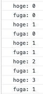

# こんにちは

どうも、僕です。  
プレイドのインターンで人生で初めて業務でフロントエンドを書いてから3ヶ月半が経ちました。  
プレイドでは Vue と Svelte を書いていて、最後の2週間くらいは React を書いていましたが、まだまだよくわからない点が多く、特に hooks 周りを自分はしっかり理解してませんでした。  
プレイドでは Vue と Svelte を書いていて、最後の2週間くらいは React を書いていましたが、まだまだよくわからない点が多く、特に hooks 周りを自分はしっかり理解してませんでした。  
誰かから、useState と useEffect だけわかってれば問題ないと言われていたのですが、実際に書いてみて「問題あるじゃねえか！！」って思ったのを覚えています。  
今回は、React でメモ化をしてみようと思います。  


# そもそもメモ化とは何か

メモ化とは、最適化手法の一種で、返す値が冪等な場合に初回の処理の結果を記録し、2回目以降はそれを返すようにするというものです。  
1回目も2回目も3回目も4回目もず〜っと一緒な結果を返すときに、それを返す関数やらを毎回実行するのではなく、何回やっても同じなのだから記録したものを返そうねと言ったものです。  
毎回計算やら関数実行やらをしなくなるのでパフォーマンスが向上します。  
  
# React でメモ化を行うには

メモ化について理解したところで、React でメモ化を行うにはどうすればいいのでしょうか？  
答えは、React.memo を使用することです。  
コードで言うと [このあたり](https://github.com/facebook/react/blob/main/packages/react/src/ReactMemo.js#L12) です。  
React.memo は props の変更のみをチェックし、コンポーネントが描画した結果をメモ化します。再レンダリングされるときに、メモ化してる内容と比較をすることにより、不要な再レンダリングをスキップします。  
React.memo はオブジェクトの浅い比較を行なっており、[shallow compare](https://reactjs.org/docs/shallow-compare.html) のドキュメントにもあるのですが、浅い比較が等価かどうかによって boolean 値を返し、その boolean によって再レンダリングをするかを決めます。  
浅い比較とは、オブジェクトの1層目のみを比較するということです。


## React.memo を使ってみる

React.memo を手を動かして肌で感じます。  
まずは、React.memo を仕込まない形で以下のようなコンポーネントを定義します。クリックするとカウントアップするようなコンポーネントです。  

```tsx
import React, { useState } from 'react'
import './App.css'

const CountUp = ({ buttonName, count }: { buttonName?: string, count: number }) => {
  // ここで動作確認
  console.log(`${buttonName}: ${count}`);
  return (
    <div>
      {buttonName}: {count}
    </div>
  );
};

function App() {
  const [count1, setCount1] = useState(0);
  const [count2, setCount2] = useState(0);

  return (
    <div className="App">
      <CountUp buttonName={'hoge'} count={count1} />
      <CountUp buttonName={'fuga'} count={count2} />
      <button onClick={() => {
        setCount1(count1+1);
      }}
      >
        button1
      </button>
      <button onClick={() => {
        setCount2(count2+1);
      }}
      >
        button2
      </button>
    </div>
  );
};
```

この状態で、どちらかのボタンを押すと、両方のコンポーネントが再レンダリングされてしまいます。実際に、ボタンをぽちぽちすると以下のようになります。  



これを、メモ化するとどうなるでしょうか？React.memo で CountUp コンポーネントを囲うだけでメモ化は実現することができます。

```tsx
import React, { useState } from 'react'
import './App.css'

// 囲うだけ
const CountUp = React.memo(({ buttonName, count }: { buttonName?: string, count: number }) => {
  console.log(`${buttonName}: ${count}`);
  return (
    <div>
      {buttonName}: {count}
    </div>
  );
});

function App() {
  const [count1, setCount1] = useState(0);
  const [count2, setCount2] = useState(0);

  return (
    <div className="App">
      <CountUp buttonName={'hoge'} count={count1} />
      <CountUp buttonName={'fuga'} count={count2} />
      <button onClick={() => {
        setCount1(count1+1);
      }}
      >
        button1
      </button>
      <button onClick={() => {
        setCount2(count2+1);
      }}
      >
        button2
      </button>
    </div>
  );
};
```

React.memo でコンポーネントを囲うだけで、以下のように別々にレンダリングされるようになりました。これはメモ化により、コンポーネントの値が保持されているからで、無駄なレンダリングを減らしてくれているおかげです。  


# useMemo と useCallback

useMemo と useCallback についてです。  
useMemo と useCallback はメモ化を行うための react hooks で、useMemo は関数の結果を、useCallback は関数自体をメモ化します。  
useMemo も useCallback も、useEffect のように第二引数に依存関係の配列を渡すことができ、useMemo は依存配列の要素のいずれかが変化した場合にのみメモ化された値を再計算します。また、useCallback は引数に渡された関数をメモ化し、その関数は依存配列の要素のいずれかが変化した場合にのみメモ化された関数を再度メモ化します。  
  
つまり、値を返すか callback 関数を返すかの違いだけになるので、結局以下の2つの関数は等価になります。  

```tsx
useCallback(fn, deps)  
useMemo(() => fn, deps) 
```

## useMemo を使ってみる

useMemo の使い所として、context などを保存しておく場合や、チェックボックスなどの UI コンポーネントで状態を保持しておくためにつか話rてたりします。chakra-ui の checkbox の state は useMemo が使われていたりします。（[参考](https://github.com/chakra-ui/chakra-ui/blob/main/packages/checkbox/src/checkbox.tsx#L129-L139)）  

useMemo は値をメモ化します。例えば、やたら計算時間が長いものを引数に渡して、2回目以降のレンダリングがどうなるかを確かめればいいわけです。注意ですが、メモ化できるのは何回やっても同じ計算結果になるものです。  
上で説明したメモ化と同様で、再レンダリングを抑制するので、下のような関数で思い処理をはさむときに hoge という文字をクリックしたら再レンダリングがかかって遅くなりましたみたいなのをなくすために useMemo を使用すると便利ということです。

```tsx
const Component = () => {

  const [count, setCount] = useState(0);
  const fn = (hoge) => {
    // なんらかの重い処理
  };

  const memoFn = useMemo(() => fn(arg), [deps]);
  const handleClick = () => {
    setCount(count + 1);
  }
  
  return (
    <div>
      <p onClick={handleClick}>hoge</p>
      {memoFn}
    </div>
  );
};
```


## useCallback を使ってみる　

useCallback の使い所として、keydown event などの何回やっても同じ処理が思い浮かびます。  
実際、chakra-ui の keydown は useCallback で実装されてたりしますし（[参考](https://github.com/chakra-ui/chakra-ui/blob/main/packages/modal/src/use-modal.ts#L104-L117)）、Material UI でも同じような実装になっています。  

useCallback は React.memo を使用しているコンポーネントに対して使わないと状態が更新されるたびに毎回呼ばれてしまいます。例えば handleClick はクリックするたびに関数が実行されてしまいます。

```tsx
const Component = () => {
  const handleClick = (event) => {
    console.log(event.currentTarget.id);
  };

  return (
    // React.memo を使用している Takurinton というコンポーネント
    <Takurinton id="takurinton" onClick={handleClick} />
  );
}
```

しかし、以下のようにした場合、初回は同様に関数が呼ばれますが、2回目はメモ化された関数が利用されます。  
これは、useCallback の効果により、handleClick は初期レンダリングと同じオブジェクトとなるからです。  
逆にいうと、React.memo を使用していないコンポーネントに対しては、useCallback を使用してもしなくてもパフォーマンス上の影響はないとされています。


```tsx
const Component = () => {
  const handleClick = useCallback((event) => {
    console.log(event.currentTarget.id);
  });

  return (
    // React.memo を使用している Takurinton というコンポーネント
    <Takurinton id="takurinton" onClick={handleClick} />
  );
}
```


# まとめ

ここらへんの記事読んで満足してました。  
すごいわかりやすい記事がたくさんあっていい時代になったなと思っています。  

- [【React】もっと速くなる！？React.memo, useCallBack, useMemoでパフォーマンス最適化に挑戦！](https://qiita.com/seira/items/9e38204758030cd5442a)
- [React.memo / useCallback / useMemo の使い方、使い所を理解してパフォーマンス最適化をする](https://qiita.com/soarflat/items/b9d3d17b8ab1f5dbfed2)

最近、React をしっかり触るようになって、OSS のコードを読んでいく過程でやはり useEffect と useState だけで目を瞑るのは良くないなと感じて書きました。  
このような hooks は適材適所だと思うので、適切に使えるようにしていきつつ、フロントエンドのパフォーマンスについて考えられるようにしていきたいです。
