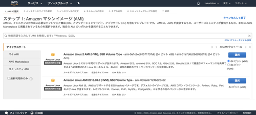

# はじめに
こんにちは。疲れた。
てことで今回は僕がはじめてAWSを使ったときに詰まったところについてまとめたいと思います！！！
また、この記事はQiitaにも全く同じことが書いてありますので、見やすい方がいいなと思ったら素直にQiitaに言ってください。
URLは[こちら](https://qiita.com/takurinton/items/6f1e98907ba4043be745)です


# 僕のレベル
AWSって何？？？？
まず最初に言っておきますが、私はこのレベルの人間です。AWSって言葉は知ってるけど中身は知らない、また、インフラの知識も皆無の状態から始めました。
いろいろググった結果、今回はAWSのEC2というインスタンスを使用して実際にアプリをデプロイしてみよう！という結論に至りました。
また、本当はSSLとデータベースの設定もしたかったのですが、それについては後日投稿します。


# 環境
OS: Amazon Linux 2 AMI
Python: 3.7.3
Django: 2.2.0
Nginx: 1.10.3
Gunicorn: 19.7.1
Supervisor: 3.3.3


# インスタンスを作る
AWSのアカウントを取得した後に、EC2というインスタンスを作成します。




今回はこの一番上のAmazon Linux 2 AMIというインスタンスを使用しました。


インスタンスタイプの選択では、デフォルトで選択されているt2.microを選択しました。

あとは適当にぽちぽちやって行きますが、最後の確認画面でSSHキーを発行することを忘れないでください！！！
任意の場所に保存しても大丈夫ですが、/.ssh下に保存することをお勧めします。


# AWSにログインする
先ほど発行したSSHキーを使用してログインします。また、インスタンスのコンソールに移動してIPv4 パブリック IPも控えておいてください。


次に、ご自身のパソコンのターミナルに移動して、以下のコマンドを叩きます。

```
$ ssh -i 先ほど保存したSSHキー ec2-user@先ほど控えたパブリックIP
```

パスなどに注意して行ってください。

権限がないというエラーが出てきた人は、sudoをつけて実行してください。パスワードが求められるかと思いますので、入力して次へ進んでください。


```
       __|  __|_  )
       _|  (     /   Amazon Linux 2 AMI
      ___|\___|___|

https://aws.amazon.com/amazon-linux-2/
```

ログインできたらこのような画面になるかと思います。


# 必要な環境を整える

##Python
まずは今回Djangoを使用するので、Pythonの環境を整えます。Pythonについては、pyenvを使用します。
インストールをして、パスを通します。

```
$ git clone https://github.com/yyuu/pyenv.git ~/.pyenv
$ export PYENV_ROOT="$HOME/.pyenv"
$ export PATH="$PYENV_ROOT/bin:$PATH"
$ eval "$(pyenv init -)"
```


インストールできてることを確認したら、Pythonをインストールします。今回は私のマシンに入っているバージョンと同じ3.7.2を使用したいと思います。

```
$ CFLAGS="-fPIC" pyenv install 3.7.2
```

少々時間がかかるかと思いますが、インストールが完了したら以下のコマンドでPythonを有効にしましょう。globalとは、全ての環境に適用するという意味です。localにすれば今いるところだけで有効になります。
バージョンを確認すると無事出てくるかと思います。

```
$ pyenv global 3.7.2
$ python -V
Python 3.7.2
```


## Django 
次に必要なライブラリやパッケージのインストールになりますが、多すぎるため割愛します。最低限必要なものとして、Djangoとgunicorn、supervisorだけインストールします。


```
$ pip install Django 
$ pip install gunicorn 
$ pip install supervisor
```

これで完了です。

## Nginx 
次にNginxのインストールをします。

```
$ sudo yum install nginx
```

起動コマンド、終了コマンドはそれぞれ以下のようになっています。

```
$ sudo nginx #起動
$ sudo nginx -s stop #終了
```

これで適宜対応しましょう。


# Djangoプロジェクトの作成
今回はローカルでもともと作成していたものがあるので、それを利用します。
ソースコードは自分のレポジトリから持ってくるものとします。

その時注意すべきことは、settings.pyに以下の記述をすることです

```
ALLOWED_HOSTS = ['パブリックIPアドレス']
```

のように変更しておきましょう！！


```
$ git clone 自分のプロジェクトのURL
$ cd パス
$ python manage.py runserver 0:8000
``` 


※もし私のプロジェクトを使用したい方がいたら[こちら](https://github.com/takurinton/mysite)
にソースコードがあります。


ここまで行ったら```http://自分のパブリックIP:8000```にアクセスしてみましょう！


トップ画面に自分のプロジェクトの内容、または新規作成した方はDjangoのロケットが表示されたかと思います。


# gunicornを使用してサーバーを立ち上げる

gunicornはPythonのwsgiというサーバであり、wsgiはサーバとアプリをつなぐ役目をしています。先ほどいじったsettings.pyと同じ階層にwsgi.pyがあるかと思いますが、それを使用します。
今回起動するにあたって、project内(settings.pyの1つ上の階層)から実行しないと動きません。そこを注意してください。

```
$ gunicorn 自分のプロジェクトの名前.wsgi --bind=0:8000
```

これで先ほどアクセスした```http://自分のパブリックIP:8000```に再度アクセスすると、同じ画面が表示されるかと思います。
表示されない方は、どこかしら間違っているかと思います。私の場合ですと

- 実行する階層が違う
- パスが通っていない
- ALLOWED_HOSTSにIPを追加していない

などでした。


# Nginx

次にNginxの設定をしていきます。
Nginxをインストールした際に作られるnginx.confを編集します。
これに関しては環境やバージョンによって場所が違うみたいですが、私の場合は/etc/nginx/nginx.confにありました。/etc/nginx.confの方もいらっしゃるようです。

それではnginx.confを自分色に染めていきます。
vimがデフォルトで入ってるかと思いますので、vimを使用して編集しましょう。

``` $ vim /etc/nginx/nginx.conf ```

```
〜中略〜

http {
    〜略〜

    upstream app_server {
        server 127.0.0.1:8000 fail_timeout=0;
    }

    server {
        #以下を消すかコメントアウトする
        #listen       80 default_server;
        #listen       [::]:80 default_server;
        #server_name  localhost;
        #root         /usr/share/nginx/html;

        # 次の3行を追加する
        listen    80;
        server_name     自分のパブリックIPアドレス;
        client_max_body_size    4G;

        # Load configuration files for the default server block.
        include /etc/nginx/default.d/*.conf;

        location / {
            # 以下の4行を追加
            proxy_set_header X-Forwarded-For $proxy_add_x_forwarded_for;
            proxy_set_header Host $http_host;
            proxy_redirect off;
            proxy_pass   http://app_server;
        }

    〜略〜
```

このような形で記述します。
自分でもよく理解してませんが、おそらくproxy_passからupstreamに値が渡され、そこからサーバを起動するという形でしょうか。。。
間違ってたらコメントか編集リクエストください。


## 起動してみる
ここまできたら起動してみましょう！！

```
$ sudo nginx -s stop
$ sudo nginx 
$ gunicorn 自分のプロジェクトの名前.wsgi --bind=0.0.0.0:8000
```

これで```http://自分のIP```にアクセスしてみてください。表示されればOKです！！！


# Supervisorを使用してデーモン化する
ここでPython2を使用するという記事もあるみたいですが、だめです。
Python3で実行しないと動きません。これマジ大事。。。

それでは、設定ファイルを作成して行きます。

```
$ sudo echo_supervisord_conf > /etc/supervisord.conf
```

この設定ファイルを編集してきます。

```
$ sudo vim /etc/supervisord.conf
```

```
〜略〜
[supervisord]
logfile=/var/log/supervisord.log ; ログファイルの保存先を変更(権限がないとダメかも)
#消すかコメントアウト
;logfile=/tmp/supervisord.log ; main log file; default $CWD/supervisord.log 
logfile_maxbytes=50MB        ; max main logfile bytes b4 rotation; default 50MB
logfile_backups=10           ; # of main logfile backups; 0 means none, default 10
loglevel=info                ; log level; default info; others: debug,warn,trace
pidfile=/var/run/supervisord.pid ; 追加
;pidfile=/tmp/supervisord.pid ; supervisord pidfile; default supervisord.pid #消すかコメントアウト

〜略〜
# includeはコメントアウトされているのでコメント外す
[include]
files = supervisord.d/*.conf ; 実行用ファイルの場所、今から作ります。
;files = relative/directory/*.ini
```

上の設定ファイルで指定したファイルがないと怒られてしまうので、ファイルを作成します。

```
$ sudo touch /var/log/supervisord.log
$ sudo chown ec2-user /var/log/supervisord.log
$ sudo chgrp ec2-user /var/log/supervisord.log
$ sudo chmod 774 /var/log/supervisord.log #権限を追加
```

ログテーションを追加します

```
$ sudo sh -c "echo '/var/log/supervisord.log {
       missingok
       weekly
       notifempty
       nocompress
}' > /etc/logrotate.d/supervisor"
```

次に先ほどincludeに記述したファイルを作成していきます。

```
$ sudo mkdir /etc/supervisord.d
```

/etc/supervisord.d直下に起動用のファイルを作成します。vimでも使いましょう。

```
sudo vim /etc/supervisord.d/app
```

```
[program:django_app]
directory=/home/ec2-user/自分のプロジェクト
command=gunicorn 自分のプロジェクトの名前.wsgi --bind=0:8000
numprocs=1
autostart=true
autorestart=true
user=ec2-user
redirect_stderr=true
```


ここ間違えると詰みます。頑張ってください( ＾∀＾)

ここまできたら、supervisorを起動します。
まず先ほどたくさん作成したconfファイルを読み込ませます。

```
$ supervisorctl reread
$ supervisorctl reload
```

次にsupervisorを起動します。起動コマンドは以下の通りです。

```
$ supervisord
```

ここでコマンド状態を確認してみましょう。

```
$ supervisorctl status
app RUNNING pid 00000, uptime 0:00:00
```
このようにRUNNINGとなっていればOK！


```http://自分のIP``` にアクセスしてみましょう！自分のサイトが表示されてれば完了です！


お疲れ様でした！


#まとめ
いろいろなサイトを参考にしたり、人に頼ったりしながらなんとかデプロイできました。SSLにできてないので、これからやっていきます。とりあえずデーモンにできたことで満足。。。
インフラの知識もつけて、フルスタックエンジニアになりたいと思ってるので、これからも頑張りたいです！

また、今回作成したサイトのソースコードは[こちら](https://github.com/takurinton/mysite)にあります。
READMEに概要や詰まったところがまとめてあります。参考までに見てみてください。
以上です。

長くなりましたが誰かのお役に立てれば幸いです。
